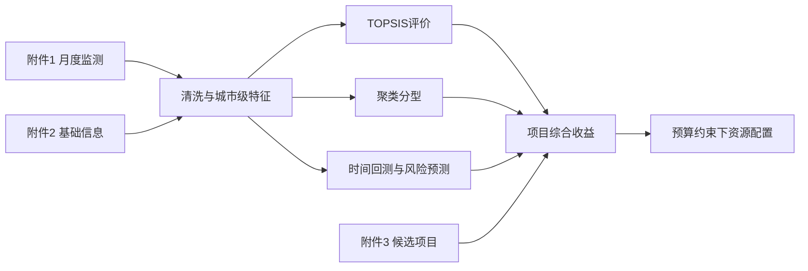

# 模拟C题完成指南与验收

## 建议时间盒

| 阶段 | 时间 | 最低输出 |
|---|---:|---|
| 审题与数据字典 | 30分钟 | 字段、单位、主键、问题链 |
| 数据审计与清洗 | 90分钟 | 清洗日志、异常表、合并表 |
| 评价与分型 | 90分钟 | 得分排名、聚类、敏感性 |
| 预测与回测 | 120分钟 | 基线、模型、误差、预测图 |
| 优化配置 | 90分钟 | 变量、目标、约束、方案 |
| 复现与表达 | 60分钟 | 一键运行、Excel、图、README |

## 分问之间的数据流

## 验收清单

### 数据

- [ ] 主键关系经过 `validate`检查。
- [ ] 清洗前后行数和规则有日志。
- [ ] 日期顺序、单位与指标方向正确。
- [ ] 原始数据未覆盖。

### 模型

- [ ] 有可解释的简单基准。
- [ ] 训练、验证、测试或时间回测边界清楚。
- [ ] 权重、阈值和随机种子可追踪。
- [ ] 指标选择与业务损失一致。

### 结果

- [ ] 排名可用极小人工样例复核。
- [ ] 优化方案逐条验证约束。
- [ ] 至少做一项敏感性和一项替代设定稳健性。
- [ ] 图表有标题、单位、图例并由代码保存。

### 工程

- [ ] 新终端中可从头运行。
- [ ] 输出目录可删除后重新生成。
- [ ] README说明依赖与运行入口。
- [ ] 队友能在5分钟内找到结果表和图。

## 参考实现使用规则

参考实现位于 `13-VSCode代码/综合项目参考实现`。至少独立工作4小时后再查看；只比较目录、函数边界和验证方法，不要直接把参考数值当自己的结果。
