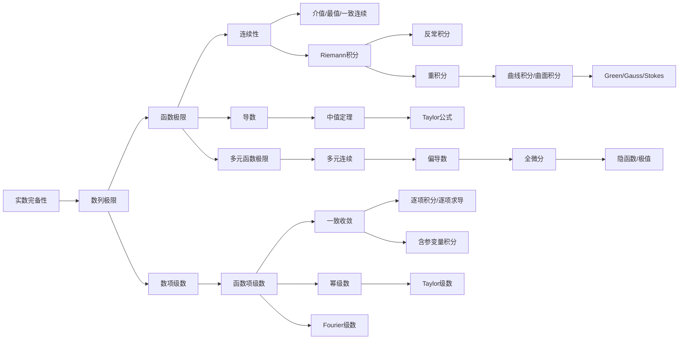
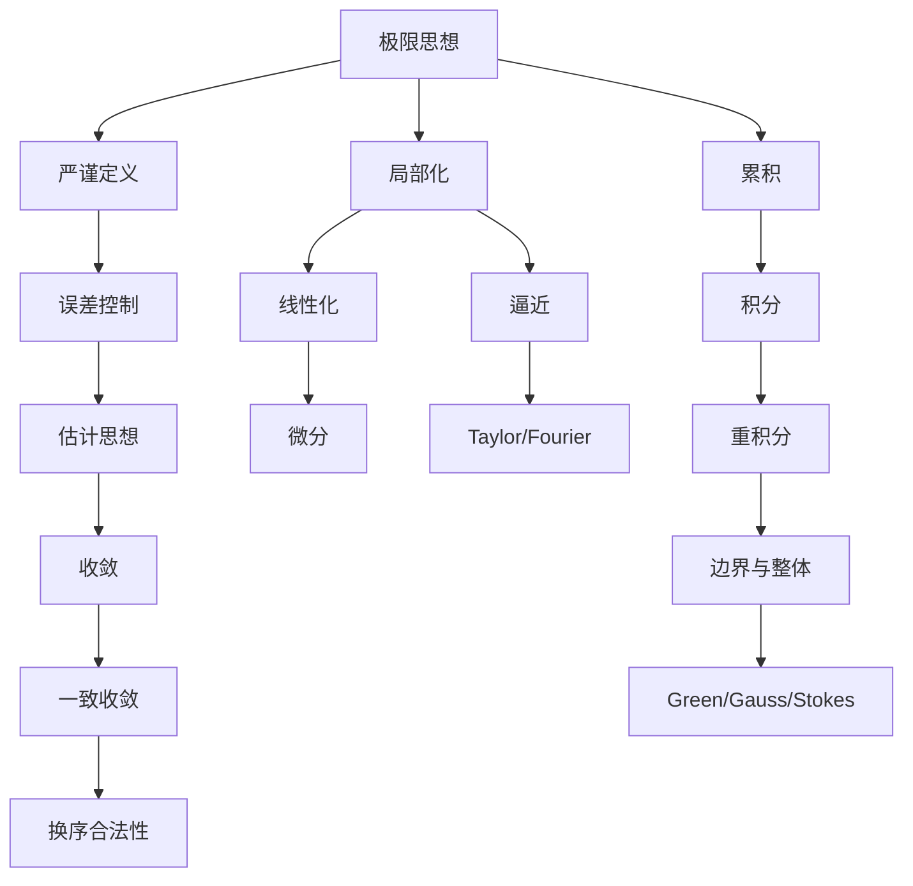

# 数学分析总纲：这门课到底在研究什么？

## 1. 数学分析的核心问题

数学分析研究的不是“怎么求导、怎么积分”这么表层的事，而是研究：

> 当变量发生无限接近、无限分割、无限累加、无限逼近时，数学对象是否仍然有确定意义，以及这些过程能否被严格控制。

高中微积分更像“会用公式”：知道导数公式、积分公式、极值方法。数学分析则追问公式为什么成立、什么时候成立、什么时候会失效。

比如高中会说：

$$
\left(\sum_{n=1}^{\infty}u_n(x)\right)'=\sum_{n=1}^{\infty}u_n'(x).
$$

数学分析会问：凭什么能把导数放进无穷求和号里？如果不能，反例是什么？如果能，需要什么条件？这就是数学分析和普通计算型微积分的本质区别。

数学分析反复研究[[极限]]，是因为导数、积分、级数、连续、Taylor 展开、Fourier 展开，本质上都是极限：

| 概念 | 本质 |
|---|---|
| 数列极限 | 无穷远处的稳定值 |
| 函数极限 | 自变量无限接近时函数值的稳定行为 |
| 导数 | 差商的极限 |
| 定积分 | 分割求和的极限 |
| 级数 | 部分和的极限 |
| 函数项级数 | 函数部分和的极限 |
| 多元极限 | 多方向趋近下的稳定行为 |

数学分析中的严谨性，体现在它不满足于“看起来趋近”，而要求你能说清：

- 谁在变化；
- 变化到哪里；
- 误差怎么控制；
- 控制是否对所有对象都成立；
- 条件是否足够；
- 去掉条件会不会失败。

所以定义、定理、证明重要，不是因为数学喜欢形式主义，而是因为无限过程很容易欺骗直觉。定义负责把直觉变成精确语言；定理负责告诉你在什么条件下可以安全操作；证明负责解释为什么这些操作不会出错。

## 2. 数学分析的第一性原理

### 2.1 极限思想是什么

[[极限]]思想的核心是：

> 一个对象不一定真正到达某个值，但可以无限接近它，并且这种接近可以被任意精度地控制。

数列极限：

$$
\lim_{n\to\infty}a_n=A
$$

意思不是“$a_n$ 越来越像 $A$”这么模糊，而是：

$$
\forall \varepsilon>0,\ \exists N,\ \forall n>N,\ |a_n-A|<\varepsilon.
$$

这句话的灵魂是：你给我任意精度 $\varepsilon$，我都能找到一个阶段 $N$，从此以后误差永远小于 $\varepsilon$。

### 2.2 无限过程为什么需要严格处理

有限过程通常符合直觉。有限多个数相加，可以交换顺序；有限个连续函数相加，仍然连续；有限次求导和求和可以交换。

无限过程就不同了。

例如：

$$
\sum_{n=1}^{\infty}\frac{(-1)^{n+1}}{n}
$$

收敛但不绝对收敛。它重新排列后，和可能改变。这说明有限加法的交换律不能随便推广到无穷加法。

再比如函数列 $x^n$ 在 $[0,1]$ 上点态收敛，但极限函数不连续。这说明连续函数列的极限不一定连续。

数学分析就是给无限过程装上“安全阀”。

### 2.3 什么是“用有限语言控制无限过程”

无限过程无法逐项检查完，所以数学分析用有限的逻辑语句控制它。

例如级数收敛：

$$
\sum_{n=1}^{\infty}a_n \text{ 收敛}
$$

不是说你真的把无限项加完，而是看部分和

$$
S_n=\sum_{k=1}^{n}a_k
$$

是否有极限。

这就是典型的“用有限语言控制无限过程”：每个 $S_n$ 是有限和，但通过 $n\to\infty$ 的极限，定义无穷和。

### 2.4 为什么 epsilon-delta 语言是基础

$\varepsilon$-$\delta$ 语言的意义是：它把“靠近”变成了可检验的误差控制。

函数极限：

$$
\lim_{x\to x_0}f(x)=A
$$

严格表达为：

$$
\forall \varepsilon>0,\ \exists \delta>0,\ 0<|x-x_0|<\delta \Rightarrow |f(x)-A|<\varepsilon.
$$

这里 $\varepsilon$ 控制结果误差，$\delta$ 控制输入范围。

分析的很多证明，本质都是：

> 为了让结果误差小于 $\varepsilon$，我需要把输入、分割、尾项、邻域、下标控制到什么程度？

### 2.5 数学分析如何把直觉变成命题

直觉说：“连续函数没有跳跃。”

数学分析说：

$$
\forall \varepsilon>0,\ \exists \delta>0,\ |x-x_0|<\delta \Rightarrow |f(x)-f(x_0)|<\varepsilon.
$$

直觉说：“导数是瞬时变化率。”

数学分析说：

$$
f'(x_0)=\lim_{x\to x_0}\frac{f(x)-f(x_0)}{x-x_0}.
$$

直觉说：“积分是无限多个小面积相加。”

数学分析说：积分是 Riemann 和在分割加细时的极限。

数学分析的工作，就是把直觉变成定义，再从定义推出定理。

## 3. 整门课程的核心主线

### 3.1 [[实数完备性]]

实数完备性是数学分析的地基。它保证“应该存在的极限”真的存在。

常见形式包括：

- 单调有界数列必收敛；
- Cauchy 列必收敛；
- 确界原理；
- 区间套定理；
- Bolzano-Weierstrass 定理。

没有完备性，很多极限会“有洞”。有理数中 $\sqrt2$ 可以被有理数列逼近，但极限不在有理数里。

它引出数列极限，因为完备性首先要回答：一个无限变化的数列什么时候有极限？

### 3.2 [[数列极限]]

数列极限是最简单的极限模型：只有一个离散变量 $n$，趋向无穷。

它解决的问题是：

> 一串数是否最终稳定到某个值？

数列极限训练你掌握 $\varepsilon$-$N$ 语言，也为级数、函数列、Riemann 和打基础。

它引出函数极限，因为现实中的变量不只是 $n\to\infty$，还可能是 $x\to x_0$。

### 3.3 [[函数极限]]

函数极限研究：

> 当自变量接近某点时，函数值是否接近某个确定值？

它解决了导数和连续的语言基础。

函数极限比数列极限更细，因为 $x$ 可以从左、右、不同路径接近。到多元函数时，这个问题会进一步复杂化。

### 3.4 [[连续性]]

连续性把极限和函数值联系起来：

$$
\lim_{x\to x_0}f(x)=f(x_0).
$$

它解决的问题是：

> 函数的局部变化是否稳定？输入小变，输出是否小变？

连续性引出导数，因为如果函数足够稳定，我们会进一步问：它变化得有多快？

### 3.5 [[导数]]与[[微分]]

导数是差商的极限：

$$
f'(x_0)=\lim_{\Delta x\to0}\frac{f(x_0+\Delta x)-f(x_0)}{\Delta x}.
$$

它解决的问题是：

> 函数在一点附近能否用直线近似？

微分强调线性近似：

$$
f(x_0+\Delta x)=f(x_0)+f'(x_0)\Delta x+o(\Delta x).
$$

它引出中值定理，因为我们需要把局部导数信息和整体函数变化联系起来。

### 3.6 [[中值定理]]

中值定理连接局部与整体。

Lagrange 中值定理：

$$
f(b)-f(a)=f'(\xi)(b-a).
$$

它解决的问题是：

> 知道每一点的变化率，能否控制整个区间上的变化？

中值定理是证明单调性、不等式、Taylor 公式、极值判别的核心工具。

### 3.7 [[Taylor公式]]

Taylor 公式把函数局部近似从一次提升到高次：

$$
f(x)=f(x_0)+f'(x_0)(x-x_0)+\cdots+\frac{f^{(n)}(x_0)}{n!}(x-x_0)^n+R_n(x).
$$

它解决的问题是：

> 函数能否用多项式近似？误差是多少？

它引出幂级数和 Taylor 级数：如果余项趋于 0，就可以用无穷多项式表示函数。

### 3.8 [[Riemann积分]]

Riemann 积分研究累积：

$$
\int_a^b f(x)\,dx
$$

它本质上是分割、取样、求和、取极限。

它解决的问题是：

> 连续变化的量如何整体累加？

积分把局部函数值累积成整体量，并通过微积分基本定理与导数联系起来。

### 3.9 [[反常积分]]

反常积分处理普通 Riemann 积分无法直接覆盖的情况：

- 区间无界；
- 函数无界。

例如：

$$
\int_1^{+\infty}\frac{1}{x^p}\,dx.
$$

它解决的问题是：

> 无限区间或无限函数值下的累积是否有限？

它引出级数，因为反常积分和正项级数常通过积分判别法相互比较。

### 3.10 [[数项级数]]

数项级数研究无穷多个数相加：

$$
\sum_{n=1}^{\infty}a_n.
$$

它解决的问题是：

> 无限离散累积是否有限？

级数是离散版积分。正项级数、任意项级数、绝对收敛、条件收敛，都在回答无穷求和的合法性问题。

### 3.11 [[函数项级数]]

函数项级数研究无穷多个函数相加：

$$
\sum_{n=1}^{\infty}u_n(x).
$$

它解决的问题是：

> 一列函数相加后得到的和函数是否保持连续、可导、可积？

这引出一致收敛。

### 3.12 [[一致收敛]]

一致收敛是第十章的灵魂。

点态收敛允许 $N=N(x,\varepsilon)$，一致收敛要求 $N=N(\varepsilon)$。

它解决的问题是：

> 极限过程是否能在整个定义域上统一控制？

它是交换极限与连续、积分、求导的重要条件。

### 3.13 [[幂级数]]

幂级数是特殊函数项级数：

$$
\sum_{n=0}^{\infty}a_n(x-x_0)^n.
$$

它解决的问题是：

> 函数能否像多项式一样被研究？

幂级数有收敛半径，在半径内部性质很好，可以逐项积分、逐项求导。

### 3.14 [[Fourier级数]]

Fourier 级数用三角函数展开函数：

$$
\frac{a_0}{2}+\sum_{n=1}^{\infty}(a_n\cos nx+b_n\sin nx).
$$

它解决的问题是：

> 周期函数能否分解成基本振荡？

它和 Taylor 级数不同：Taylor 是局部的，Fourier 是整体的；Taylor 用导数，Fourier 用积分。

### 3.15 [[多元函数极限]]与[[多元连续]]

进入多元后，极限更复杂。因为 $(x,y)\to(x_0,y_0)$ 可以沿无穷多条路径趋近。

它解决的问题是：

> 多方向接近时，函数值是否仍有唯一稳定行为？

这为偏导数和全微分打基础。

### 3.16 [[偏导数]]与[[全微分]]

偏导数只看坐标方向：

$$
\frac{\partial f}{\partial x},\quad \frac{\partial f}{\partial y}.
$$

全微分看整体线性近似：

$$
f(x+\Delta x,y+\Delta y)=f(x,y)+A\Delta x+B\Delta y+o(\rho).
$$

它解决的问题是：

> 多元函数能否在一点附近被线性函数近似？

偏导存在不等于可微，这是多元微分最重要的观念之一。

### 3.17 [[多元函数极值]]

多元极值研究：

> 多变量函数在局部或约束条件下何时取最大/最小？

无条件极值用梯度、Hessian；条件极值用 Lagrange 乘数法。

它解决优化问题，并为几何、物理、经济模型服务。

### 3.18 [[重积分]]

重积分把一元积分推广到区域：

$$
\iint_D f(x,y)\,dxdy,\qquad \iiint_\Omega f(x,y,z)\,dV.
$$

它解决的问题是：

> 如何在平面或空间区域上累积函数值？

关键是区域、积分次序、变量代换和 Jacobian。

### 3.19 [[曲线积分]]与[[曲面积分]]

它们把积分对象从区域推广到曲线和曲面。

| 类型 | 本质 |
|---|---|
| 第一类曲线积分 | 沿弧长累积 |
| 第二类曲线积分 | 向量场沿路径做功 |
| 第一类曲面积分 | 沿面积累积 |
| 第二类曲面积分 | 向量场穿过曲面的通量 |

### 3.20 [[Green公式]] / [[Gauss公式]] / [[Stokes公式]]

这三大公式是从局部到整体的巅峰。

| 公式 | 连接 |
|---|---|
| Green 公式 | 平面区域内部与边界曲线 |
| Gauss 公式 | 空间区域内部与边界曲面 |
| Stokes 公式 | 曲面上的旋度与边界曲线 |

它们解决的问题是：

> 一个区域内部的变化，能否通过边界上的积分表达？

这就是分析、几何、物理之间的深层联系。

## 4. 数学分析的核心思想

### 4.1 [[极限思想]]

通俗解释：用越来越接近的过程定义一个对象。

数学表达：

$$
\forall \varepsilon>0,\ \exists N,\ n>N\Rightarrow |a_n-A|<\varepsilon.
$$

典型例子：数列极限、函数极限、导数、积分、级数。

考试体现：证明极限、判断收敛、用定义证明连续。

常见误区：把“看起来接近”当成“已证明接近”。

### 4.2 [[局部化思想]]

通俗解释：复杂对象先在一点附近研究。

数学表达：

$$
f(x)=f(x_0)+f'(x_0)(x-x_0)+o(x-x_0).
$$

典型例子：导数、微分、Taylor 公式。

考试体现：求切线、切平面、局部极值、Taylor 展开。

常见误区：把局部结论直接推广到整体。

### 4.3 [[逼近思想]]

通俗解释：用简单对象逼近复杂对象。

数学表达：

$$
|P(x)-f(x)|<\varepsilon.
$$

典型例子：Taylor 多项式、多项式逼近、Fourier 级数。

考试体现：近似计算、展开函数、估计误差。

常见误区：只写近似式，不说明误差。

### 4.4 [[估计思想]]

通俗解释：不一定求精确值，但要控制大小。

数学表达：

$$
|f(x)-g(x)|\le M|x-x_0|^2.
$$

典型例子：夹逼定理、余项估计、Weierstrass 判别法。

考试体现：证明收敛、证明一致收敛、证明极限为 0。

常见误区：只会算，不会估。

### 4.5 [[完备性思想]]

通俗解释：没有洞，极限不会跑出实数系。

数学表达：单调有界数列必收敛。

典型例子：确界原理、Cauchy 收敛准则。

考试体现：证明存在性、证明收敛。

常见误区：只关心怎么求极限，不关心极限是否存在。

### 4.6 [[连续性思想]]

通俗解释：输入小变化导致输出小变化。

数学表达：

$$
\forall \varepsilon>0,\ \exists \delta>0,\ |x-x_0|<\delta\Rightarrow |f(x)-f(x_0)|<\varepsilon.
$$

典型例子：介值定理、最值定理、一致连续。

考试体现：证明方程有根、证明函数有界、判断极限。

常见误区：把连续性当成画图直觉，不会用定义。

### 4.7 [[线性化思想]]

通俗解释：在很小范围内，用线性函数代替复杂函数。

数学表达：

$$
f(\mathbf{x}+\Delta \mathbf{x})=f(\mathbf{x})+df+o(\|\Delta \mathbf{x}\|).
$$

典型例子：微分、梯度、Jacobi 矩阵。

考试体现：全微分、隐函数求导、切平面。

常见误区：以为偏导存在就一定可微。

### 4.8 [[累积思想]]

通俗解释：整体量来自无数局部小量的累加。

数学表达：

$$
\int_a^b f(x)\,dx.
$$

典型例子：Riemann 积分、重积分、曲线积分、曲面积分。

考试体现：积分计算、换元、积分区域。

常见误区：只会套公式，不理解积分对象是什么。

### 4.9 [[收敛]]与[[一致收敛]]

通俗解释：收敛是稳定；一致收敛是统一稳定。

数学表达：

$$
\sup_{x\in D}|f_n(x)-f(x)|\to0.
$$

典型例子：函数项级数、含参变量积分、Fourier 级数。

考试体现：逐项积分、逐项求导、和函数连续。

常见误区：点态收敛和一致收敛混淆。

### 4.10 [[级数展开思想]]

通俗解释：用一组简单函数表示复杂函数。

数学表达：

$$
f(x)=\sum_{n=0}^{\infty}a_nx^n.
$$

典型例子：Taylor 级数、Fourier 级数。

考试体现：求展开式、求收敛半径、求 Fourier 系数。

常见误区：以为能写出形式级数就等于原函数。

### 4.11 [[维度提升思想]]

通俗解释：把一元分析推广到多元空间。

数学表达：

$$
\lim_{(x,y)\to(x_0,y_0)}f(x,y).
$$

典型例子：多元极限、全微分、重积分。

考试体现：多路径极限、偏导、重积分。

常见误区：用一元直觉处理多元问题。

### 4.12 [[从局部到整体]]

通俗解释：局部变化累积起来决定整体结构。

数学表达：

$$
\iint_D \left(\frac{\partial Q}{\partial x}-\frac{\partial P}{\partial y}\right)\,dxdy
=\oint_{\partial D}P\,dx+Q\,dy.
$$

典型例子：中值定理、微积分基本定理、Green/Gauss/Stokes 公式。

考试体现：用边界积分化区域积分，或反过来。

常见误区：只背公式，不检查区域、方向、边界条件。

## 5. “对象—问题—工具”框架

| 研究对象 | 核心问题 | 主要工具 | 典型定理 | 常见题型 |
|---|---|---|---|---|
| 数列 | 是否趋于某个数 | $\varepsilon$-$N$、单调有界、Cauchy 准则 | 单调有界定理、Bolzano-Weierstrass | 求极限、证收敛 |
| 一元函数 | 极限、连续、变化率 | $\varepsilon$-$\delta$、导数、中值定理 | 介值定理、最值定理、Lagrange 中值定理 | 极限、连续、导数、证明不等式 |
| 多元函数 | 多方向极限、局部线性化 | 路径法、偏导、全微分、梯度 | 隐函数定理、Taylor 公式、极值判别 | 多元极限、偏导、极值 |
| 数项级数 | 无限求和是否有意义 | 部分和、比较、根值、比值、积分判别 | Cauchy 判别、Leibniz、Dirichlet | 判敛散、绝对/条件收敛 |
| 函数列/函数项级数 | 极限是否保持函数性质 | 一致收敛、Weierstrass 判别 | 连续性定理、逐项积分、逐项求导 | 判一致收敛、求和函数 |
| 积分 | 局部量如何累积成整体量 | 分割求和、换元、积分估计 | 微积分基本定理、变量代换 | 积分计算、证明可积 |
| 曲线与曲面上的函数 | 沿曲线/曲面积累或通量 | 参数化、方向、法向量 | Green、Gauss、Stokes | 曲线积分、曲面积分、场论 |

## 6. 定义、定理和证明之间的关系

数学分析的定义抽象，是因为它要覆盖很多不同例子。一个好定义不是描述某个图像，而是抓住所有相关对象的共同结构。

读定义时，不要急着背。按这个模板：

| 步骤 | 问题 |
|---|---|
| 1 | 这个定义在定义什么对象？ |
| 2 | 变量是谁？趋近过程是谁？ |
| 3 | 条件中有哪些量可以依赖，哪些不能依赖？ |
| 4 | 这个定义排除了哪些反例？ |
| 5 | 最简单的正例和反例是什么？ |
| 6 | 它和已有概念有什么关系？ |

读定理时，用这个模板：

| 步骤 | 问题 |
|---|---|
| 条件 | 定理要求什么？每个条件能不能少？ |
| 结论 | 它到底推出什么？ |
| 用途 | 它用来证明存在性、计算、估计，还是换序？ |
| 反例 | 如果去掉某个条件会怎样？ |
| 证明思路 | 是用定义、构造、估计、逼近，还是反证？ |

证明题本质上考的不是“背证明”，而是：

- 你是否知道该用哪个定义；
- 你是否能把目标翻译成 $\varepsilon$ 语言；
- 你是否能找到合适估计；
- 你是否知道定理条件怎么验证；
- 你是否能把局部信息连成整体结论。

很多题的关键不是计算，而是识别结构。例如看到“和函数连续”，入口往往不是算和函数，而是先证明一致收敛。

## 7. 数学分析考试到底在考什么

| 题型 | 本质考察 | 解题入口 | 常用方法 | 易错点 |
|---|---|---|---|---|
| 概念题 | 是否理解定义边界 | 回到定义 | 举正例、反例、条件分析 | 只背关键词 |
| 证明题 | 是否能用定义和定理组织逻辑 | 翻译目标 | $\varepsilon$ 语言、估计、反证、构造 | 不检查条件 |
| 计算题 | 是否能选择合适工具 | 识别结构 | 求导、积分、换元、Taylor、级数 | 机械套公式 |
| 判别题 | 是否能判断收敛/连续/可微 | 找判别入口 | 比较、Cauchy、Weierstrass、路径法 | 判别法条件不满足 |
| 构造反例题 | 是否知道定理条件的必要性 | 想经典反例 | 分段函数、振荡函数、条件收敛级数 | 反例不满足题设 |
| 综合题 | 是否能串联多个知识点 | 拆成小问题 | 先证明条件，再套定理 | 一步跳到结论 |

## 8. 学习数学分析的正确方法

### 8.1 如何预习

预习不必看懂所有证明。重点看：

- 本节引入了什么新对象；
- 它想解决什么旧问题；
- 定义中的量有什么依赖关系；
- 例子和反例是什么。

### 8.2 如何听课

听课时抓三件事：

1. 老师为什么要引入这个定义；
2. 定理条件为什么这样写；
3. 证明中最关键的一步估计在哪里。

### 8.3 如何整理笔记

每个知识点按模板整理：

```markdown
## 概念名

- 研究对象：
- 定义：
- 直观理解：
- 关键条件：
- 正例：
- 反例：
- 常用定理：
- 考试入口：
```

### 8.4 如何做题

做题不要一上来算。先问：

- 这是极限题、连续题、可微题、积分题，还是收敛题？
- 研究对象是什么？
- 题目要我证明存在、计算数值、判断性质，还是构造反例？
- 哪个定义或定理最接近？

### 8.5 如何复盘错题

错题不要只写正确答案。要写：

| 项目 | 内容 |
|---|---|
| 错因 | 概念错、条件漏、方法选错、计算错 |
| 正确入口 | 应该先想到哪个定义/定理 |
| 触发信号 | 题目中哪个词提示该方法 |
| 下次策略 | 遇到类似题先检查什么 |

### 8.6 如何建立知识网络

用 Obsidian 时，不要只按章节建笔记，也要按思想建笔记：

- [[极限]]
- [[一致收敛]]
- [[可微]]
- [[完备性]]
- [[Taylor公式]]
- [[Green公式]]
- [[反例库]]
- [[换序条件]]

章节笔记解决“学到哪里”；思想笔记解决“为什么相通”。

### 8.7 如何避免只会背不会用

每学一个定理，立刻问：

- 它解决什么问题？
- 条件怎么验证？
- 结论能用来干什么？
- 去掉条件有什么反例？
- 考试中什么题会触发它？

### 8.8 两周内的期末复习系统

两周复习建议：

| 阶段 | 目标 | 做法 |
|---|---|---|
| 第 1-3 天 | 建总框架 | 整理章节地图和核心定理 |
| 第 4-8 天 | 主攻高频章节 | 多元微分、重积分、曲线曲面积分 |
| 第 9-11 天 | 主攻收敛与展开 | 级数、函数项级数、含参变量积分、Fourier |
| 第 12 天 | 错题二刷 | 按题型分类重做 |
| 第 13 天 | 速查表 | 定理条件、公式、判别法 |
| 第 14 天 | 模拟与压缩 | 只看高危错题和核心模板 |

## 9. 数学分析知识地图



思想关系图：



## 10. 最后总结

### 10.1 一句话总结

数学分析是研究[[极限]]及其支配下的连续、微分、积分、级数和多元推广的一门课。

### 10.2 一段话总结

数学分析的核心不是公式，而是无限过程的严格控制。它从实数完备性出发，建立极限语言，再用极限定义连续、导数、积分和级数；随后把这些思想推广到函数列、多元函数、重积分、曲线曲面积分和 Fourier 展开。整门课反复回答同一个问题：在什么条件下，我们可以安全地取极限、求导、积分、求和、换序和逼近？

### 10.3 一张表总结

| 层次 | 核心问题 | 关键词 |
|---|---|---|
| 基础 | 极限是否存在 | 完备性、数列、函数极限 |
| 局部 | 函数在一点附近怎样变化 | 连续、导数、微分、Taylor |
| 整体 | 局部量如何累积 | Riemann 积分、重积分 |
| 无穷 | 无限求和是否有意义 | 数项级数、函数项级数 |
| 换序 | 极限能否和运算交换 | 一致收敛、含参变量积分 |
| 高维 | 一元理论如何推广 | 多元极限、全微分、曲面积分 |
| 结构 | 边界和内部如何联系 | Green、Gauss、Stokes |

### 10.4 如果只能记住 10 件事

1. 数学分析的核心是[[极限]]。
2. $\varepsilon$ 语言是误差控制，不是形式主义。
3. 实数完备性保证极限存在。
4. 连续性是输入小变导致输出小变。
5. 导数和微分的本质是局部线性化。
6. 积分的本质是无限累积。
7. 级数的本质是部分和的极限。
8. 一致收敛是函数极限能否保留性质的关键。
9. Taylor 和 Fourier 都是在用简单函数逼近复杂函数。
10. Green、Gauss、Stokes 是从局部到整体、从内部到边界的桥梁。

