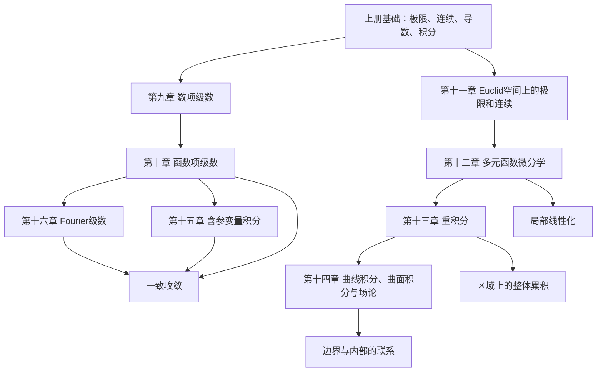

# 数学分析下册全书知识脉络总结

## 1. 全书总主线

数学分析下册的核心，是把上册的一元极限、连续、微分、积分推广到更复杂的对象上。

可以概括成四条主线：

| 主线 | 对应章节 | 核心问题 |
|---|---|---|
| 无穷过程 | 第九、十、十六章 | 无限求和、函数展开、级数收敛 |
| 多元函数 | 第十一、十二章 | 多元极限、连续、微分、极值 |
| 高维积分 | 第十三、十四章 | 重积分、曲线积分、曲面积分、场论公式 |
| 换序与展开 | 第十、十五、十六章 | 极限、积分、求导、级数之间能否交换 |

全书最重要的一句话：

> 下册研究的是：当对象从“一个变量、有限过程”变成“多个变量、无穷过程、区域/曲线/曲面积分”以后，极限、连续、微分、积分这些概念如何保持严格。

## 2. 全书知识地图

## 3. 第一条主线：无穷过程

### 第九章：数项级数

核心问题：

> 无限多个数相加，什么时候有意义？

基本对象：

$$
\sum_{n=1}^{\infty}a_n
$$

关键思想：

- 用部分和数列定义级数收敛；
- 正项级数靠单调有界；
- 任意项级数靠绝对收敛、条件收敛和正负抵消；
- 无穷乘积可通过部分积或对数转化为级数问题。

核心知识点：

| 知识点 | 用途 |
|---|---|
| 部分和 | 定义级数的和 |
| 通项趋零 | 判断发散的必要条件 |
| 正项级数 | 建立比较、根值、比值、积分等判别法 |
| 任意项级数 | 处理交错、振荡、正负抵消 |
| 绝对收敛 | 保证更序和运算稳定 |
| 条件收敛 | 说明无穷求和不能随意交换顺序 |
| 无穷乘积 | 研究无限乘法 |

考试重点：

- 判别级数敛散性；
- 判断绝对收敛或条件收敛；
- 使用比较、Cauchy、d'Alembert、Raabe、积分判别法；
- 使用 Leibniz、Abel、Dirichlet 判别法；
- 处理无穷乘积。

### 第十章：函数项级数

核心问题：

> 如果级数的每一项都是函数，无穷求和后还能保持连续、可导、可积吗？

基本对象：

$$
\sum_{n=1}^{\infty}u_n(x)
$$

第十章是第九章的函数版本。固定 $x$ 后，它是数项级数；但不同 $x$ 的收敛速度可能不同，所以必须引入一致收敛。

核心知识点：

| 知识点 | 用途 |
|---|---|
| 点态收敛 | 每个点分别收敛 |
| 一致收敛 | 整个区间统一收敛 |
| 和函数 | 函数项级数收敛后的函数 |
| Weierstrass 判别法 | 用数项级数控制函数项级数 |
| 逐项积分 | 在一致收敛条件下交换积分与求和 |
| 逐项求导 | 在更强条件下交换求导与求和 |
| 幂级数 | 最重要、性质最好的函数项级数 |
| Taylor 级数 | 用导数信息展开函数 |
| 多项式逼近 | 用多项式统一逼近连续函数 |

本章主旨：

> 点态收敛只保证每个点各自稳定；一致收敛保证整个区间一起稳定，因此能保留连续、积分等性质。

考试重点：

- 点态收敛与一致收敛的区别；
- 一致收敛判别；
- 极限与积分、求导能否交换；
- 幂级数收敛半径和端点判断；
- Taylor 展开和余项。

### 第十六章：Fourier 级数

核心问题：

> 函数能否用三角函数展开？

Taylor 级数用幂函数展开：

$$
1,x,x^2,x^3,\ldots
$$

Fourier 级数用三角函数展开：

$$
1,\cos x,\sin x,\cos 2x,\sin 2x,\ldots
$$

核心知识点：

| 知识点 | 用途 |
|---|---|
| Fourier 系数 | 计算展开系数 |
| Fourier 级数 | 用三角函数表示周期函数 |
| 正弦级数 | 适合奇函数或奇延拓 |
| 余弦级数 | 适合偶函数或偶延拓 |
| Dirichlet 收敛判别 | 判断 Fourier 级数收敛到哪里 |
| Riemann 引理 | 说明高频振荡积分趋零 |
| Fourier 变换 | 从周期展开走向非周期函数 |
| 卷积 | Fourier 分析中的运算结构 |

考试重点：

- 求 Fourier 系数；
- 判断级数收敛到函数值还是左右极限平均值；
- 奇偶延拓；
- 正弦级数和余弦级数；
- Fourier 变换和卷积的基本性质。

## 4. 第二条主线：多元函数

### 第十一章：Euclid 空间上的极限和连续

核心问题：

> 从一元函数进入多元函数后，极限和连续该如何定义？

一元函数中，变量沿数轴靠近一点；多元函数中，变量可以沿无穷多条路径靠近一点。因此多元极限比一元极限更严格。

核心知识点：

| 知识点 | 用途 |
|---|---|
| Euclid 空间 | 多元分析的基本空间 |
| 距离 | 描述点与点之间的接近 |
| 开集、闭集 | 描述局部和边界 |
| 紧集 | 多元连续函数性质的重要条件 |
| 连通集 | 研究连续映射保持区间性质的推广 |
| 多元函数极限 | 多路径趋近下的极限 |
| 累次极限 | 分变量依次取极限 |
| 多元连续函数 | 多元极限与函数值一致 |

考试重点：

- 多元极限存在性；
- 用路径法证明极限不存在；
- 区分重极限与累次极限；
- 紧集上连续函数的性质。

### 第十二章：多元函数的微分学

核心问题：

> 多元函数如何求导？导数如何描述局部线性近似？

一元函数中，导数是一个数；多元函数中，变量有多个方向，所以出现偏导数、方向导数、全微分、梯度和 Jacobi 矩阵。

核心思想：

> 多元函数真正好的“可导”不是偏导存在，而是可微，即函数在局部可以被一个线性函数近似。

核心知识点：

| 知识点 | 用途 |
|---|---|
| 偏导数 | 沿坐标方向求变化率 |
| 方向导数 | 沿任意方向求变化率 |
| 全微分 | 多元函数的线性近似 |
| 梯度 | 函数增长最快方向 |
| 高阶偏导 | 多元 Taylor 公式和极值判别 |
| 链式法则 | 多元复合函数求导 |
| 隐函数定理 | 由方程确定函数并求导 |
| 逆映射定理 | 多元映射局部可逆 |
| 曲线切线、曲面切平面 | 微分的几何应用 |
| 无条件极值 | 多元函数局部极值 |
| Lagrange 乘数法 | 条件极值 |

考试重点最高：

- 偏导、方向导数、全微分；
- 可微、连续、偏导存在之间的关系；
- 多元复合函数求导；
- 隐函数求导；
- Taylor 公式；
- 极值与条件极值；
- 几何应用。

## 5. 第三条主线：高维积分

### 第十三章：重积分

核心问题：

> 如何在平面区域、空间区域上积分？

一元积分是在区间上累积；重积分是在区域上累积。

核心对象：

$$
\iint_D f(x,y)\,dxdy
$$

核心知识点：

| 知识点 | 用途 |
|---|---|
| 二重积分 | 平面区域上的累积 |
| 多重积分 | 高维区域上的累积 |
| 累次积分 | 把重积分转化为一元积分 |
| 积分区域 | 决定积分限 |
| 改变积分次序 | 简化计算 |
| 变量代换 | 换坐标计算积分 |
| Jacobian | 变量代换中的面积/体积伸缩因子 |
| 极坐标、柱坐标、球坐标 | 处理对称区域 |
| 反常重积分 | 无界区域或无界函数的积分 |
| 微分形式 | 为曲线曲面积分和 Stokes 公式做准备 |

考试重点：

- 画区域；
- 写积分限；
- 改变积分次序；
- 极坐标、柱坐标、球坐标；
- Jacobian；
- 反常重积分。

### 第十四章：曲线积分、曲面积分与场论

核心问题：

> 如何在曲线、曲面上积分？边界积分和区域内部积分有什么关系？

第十三章在区域上积分，第十四章在曲线和曲面上积分。

四类积分：

| 类型 | 本质 | 典型含义 |
|---|---|---|
| 第一类曲线积分 | 对弧长积分 | 沿曲线累积标量 |
| 第二类曲线积分 | 对方向积分 | 向量场沿路径做功 |
| 第一类曲面积分 | 对面积积分 | 沿曲面积累标量 |
| 第二类曲面积分 | 对有向曲面积分 | 向量场通量 |

三大公式：

| 公式 | 连接什么 | 直观意义 |
|---|---|---|
| Green 公式 | 平面区域与边界曲线 | 二重积分和闭曲线积分互化 |
| Gauss 公式 | 空间区域与边界曲面 | 三重积分和通量互化 |
| Stokes 公式 | 曲面与边界曲线 | 曲面积分和环量互化 |

场论知识点：

| 知识点 | 用途 |
|---|---|
| 梯度 | 标量场变化最快方向 |
| 散度 | 向量场源汇强度 |
| 旋度 | 向量场旋转强度 |
| 保守场 | 路径无关 |
| 势函数 | 保守场的原函数 |

考试重点：

- 四类积分的区别；
- 参数化；
- 方向和侧；
- Green、Gauss、Stokes 使用条件；
- 路径无关；
- 保守场与势函数。

## 6. 第四条主线：换序与含参变量

### 第十五章：含参变量积分

核心问题：

> 积分里含参数时，能不能对参数求极限、求导、积分？

典型对象：

$$
F(y)=\int_a^b f(x,y)\,dx
$$

或

$$
F(y)=\int_a^{+\infty}f(x,y)\,dx.
$$

本章和第十章高度相似。第十章问级数能否逐项运算，第十五章问积分能否与参数极限、参数导数交换。

核心知识点：

| 知识点 | 用途 |
|---|---|
| 含参变量常义积分 | 有限区间上的参数积分 |
| 含参变量反常积分 | 无穷区间或瑕点情形 |
| 一致收敛 | 换序的核心条件 |
| 积分号下求导 | 计算参数函数导数 |
| 积分号下积分 | 改变积分顺序 |
| Beta 函数 | Euler 积分之一 |
| Gamma 函数 | 阶乘的连续推广 |
| Beta-Gamma 关系 | 特殊函数计算核心 |

考试重点：

- 含参变量积分的连续性、可导性；
- 反常积分一致收敛；
- 积分号下求导；
- Beta 函数与 Gamma 函数；
- 换序条件。

## 7. 全书关键思想对照

| 思想 | 出现章节 | 具体表现 |
|---|---|---|
| 极限定义一切 | 第九、十、十一、十五、十六章 | 级数、函数项级数、多元极限、含参积分、Fourier 收敛 |
| 一致性保证换序 | 第十、十五、十六章 | 一致收敛、逐项积分、逐项求导、含参变量积分 |
| 局部线性化 | 第十二章 | 全微分、Taylor 公式、切平面 |
| 整体累积 | 第十三、十四章 | 重积分、曲线积分、曲面积分 |
| 边界与内部互化 | 第十四章 | Green、Gauss、Stokes |
| 简单函数逼近复杂函数 | 第十、十六章 | Taylor、多项式逼近、Fourier 展开 |

## 8. 易混主线整理

### 点态 vs 一致

| 点态收敛 | 一致收敛 |
|---|---|
| 每个点分别收敛 | 整个区间统一收敛 |
| $N$ 可依赖 $x$ | $N$ 不能依赖 $x$ |
| 不一定保持连续性 | 可保持连续性 |
| 不一定能换积分、求导 | 在相应条件下可换序 |

### 偏导存在 vs 可微

| 偏导存在 | 可微 |
|---|---|
| 只看坐标方向变化 | 要有整体线性近似 |
| 不一定连续 | 可微推出连续 |
| 不一定能写全微分 | 可写全微分 |
| 条件较弱 | 条件较强 |

### 重积分 vs 曲线曲面积分

| 积分类型 | 积分对象 |
|---|---|
| 重积分 | 平面/空间区域 |
| 第一类曲线积分 | 曲线长度 |
| 第二类曲线积分 | 有向曲线 |
| 第一类曲面积分 | 曲面面积 |
| 第二类曲面积分 | 有向曲面 |

### Taylor 级数 vs Fourier 级数

| Taylor 级数 | Fourier 级数 |
|---|---|
| 用幂函数展开 | 用三角函数展开 |
| 依赖某一点导数 | 依赖区间整体积分 |
| 更局部 | 更整体 |
| 适合解析函数 | 适合周期函数 |

## 9. 期末复习优先级

| 优先级 | 章节 | 复习重点 |
|---|---|---|
| 最高 | 第十二章 多元函数微分学 | 偏导、全微分、复合求导、隐函数、极值、Lagrange |
| 最高 | 第十三章 重积分 | 区域、换序、变量代换、极坐标、反常重积分 |
| 最高 | 第十四章 曲线积分、曲面积分与场论 | 四类积分、Green、Gauss、Stokes、保守场 |
| 高 | 第十章 函数项级数 | 一致收敛、幂级数、Taylor 展开 |
| 高 | 第十五章 含参变量积分 | 一致收敛、积分号下求导、Beta/Gamma |
| 中高 | 第十六章 Fourier 级数 | Fourier 系数、收敛、正弦余弦展开 |
| 中 | 第九章 数项级数 | 判别法、绝对/条件收敛 |
| 中 | 第十一章 Euclid 空间 | 多元极限、连续、紧集、连通集 |

## 10. 最后总括

数学分析下册不是一堆孤立章节，而是一张逐步扩展的网：

1. 第九章把有限求和推广到无穷求和；
2. 第十章把数项级数推广到函数项级数；
3. 第十一章把一元极限推广到多元空间；
4. 第十二章把一元导数推广到多元微分；
5. 第十三章把一元积分推广到区域积分；
6. 第十四章把区域积分推广到曲线、曲面和场论；
7. 第十五章研究积分与参数之间的换序问题；
8. 第十六章用三角函数展开函数，回到“函数项级数”的大框架。
