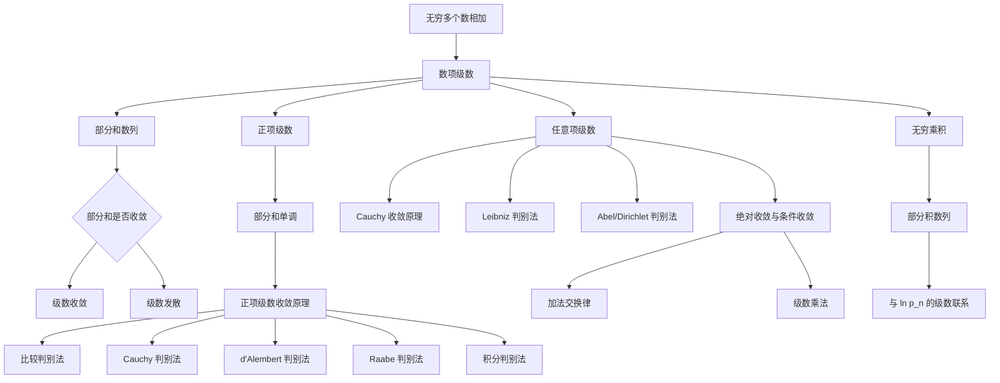

# 第九章：数项级数

> 依据 PDF 第 21-68 页整理。PDF 为扫描版，无可抽取文字层；本笔记已按页面图像核对主要定义、定理和章节结构。个别公式编号或细节若标注“需人工确认”，后续做习题时应回到扫描页逐项核对。

## 1. 本章在研究什么

本章研究的核心问题是：无限多个数相加，什么时候有意义？

有限个数相加时，我们默认可以随便加括号、交换顺序、先乘后加；但一旦项数变成无穷，事情就变得危险。教材开头用 Zeno 的 Achilles 追乌龟故事说明：一个有限时间或有限距离可以被分成无穷多个小段，于是自然出现

$$
t_1+t_2+\cdots+t_n+\cdots
$$

这样的“无穷和”。问题不是写出这个符号，而是问：这个符号到底代表一个数吗？

本章的回答是：不要直接把无穷多个数相加，而是先看前 $n$ 项和

$$
S_n=x_1+x_2+\cdots+x_n,
$$

再研究数列 $\{S_n\}$ 是否有极限。如果 $S_n$ 趋向某个有限数 $S$，就说级数收敛，和为 $S$。

为什么要引入这些概念？

- [[部分和]]让“无穷求和”变成已经学过的“数列极限”。
- [[正项级数]]利用单调性，把收敛问题化成“部分和是否有上界”。
- [[上极限]]和[[下极限]]帮助处理不收敛但仍有规律的数列，尤其服务于根值判别等方法。
- [[绝对收敛]]和[[条件收敛]]解释为什么有些收敛级数不能随意交换项。
- [[无穷乘积]]把“无限相乘”也纳入类似的极限框架。

它和前面章节的关系：本章直接使用数列极限、单调有界原理、Cauchy 收敛原理、Bolzano-Weierstrass 定理，以及反常积分。也就是说，它不是从零开始的新对象，而是把“数列极限”升级为“无穷运算”。

它和后面章节的关系：第十章函数项级数会把这里的数项级数推广到“每一项都是函数”的情形；Fourier 级数、幂级数、含参变量积分中的逐项运算，都会反复用到本章思想。

考试中通常怎么出现：

- 判断一个级数收敛、发散、绝对收敛或条件收敛；
- 求某些可裂项级数的和；
- 选择合适判别法；
- 证明上极限/下极限性质；
- 判断无穷乘积收敛性；
- 说明为什么某个判别法失效，不能乱用。

## 2. 本章知识地图

章节结构：

1. §1 数项级数的收敛性：定义、部分和、余和、基本性质。
2. §2 上极限与下极限：为处理不收敛数列提供工具。
3. §3 正项级数：最常考的一组判别法。
4. §4 任意项级数：交错、绝对/条件收敛、Abel/Dirichlet、更序与乘法。
5. §5 无穷乘积：用部分积和级数方法研究无限相乘。

## 3. 核心概念详解

### [[数项级数]]

#### 定义

设 $x_1,x_2,\ldots,x_n,\ldots$ 是无穷可列个实数，形式和

$$
x_1+x_2+\cdots+x_n+\cdots
$$

称为数项级数，记为

$$
\sum_{n=1}^{\infty}x_n.
$$

其中 $x_n$ 称为级数的通项或一般项。

#### 直观理解

数项级数不是“真的一次性把无穷多个数加完”。它是一种过程：第 1 步加一项，第 2 步加两项，第 $n$ 步加前 $n$ 项，然后看这个过程是否稳定到一个数。

#### 为什么要引入这个概念

很多有限量可以被分成无穷多个小量，例如距离、时间、面积、概率。数项级数给了我们一种严格语言，判断这些小量“加起来”是否仍然是有限数。

#### 关键条件

- 通项 $x_n$ 是实数；
- 级数是否有和，不由符号本身决定，而由部分和极限决定；
- $\sum x_n$ 收敛时，必须有 $x_n\to 0$。

#### 典型例子

几何级数

$$
\sum_{n=0}^{\infty}q^n
$$

当 $|q|<1$ 时收敛，和为 $\frac{1}{1-q}$。因为它的部分和可以显式写成

$$
S_n=\frac{1-q^{n+1}}{1-q},
$$

当 $q^{n+1}\to 0$ 时，$S_n\to \frac{1}{1-q}$。

#### 反例或易错例子

级数

$$
\sum_{n=1}^{\infty}(-1)^{n-1}
$$

通项不是趋于 $0$，部分和在 $1,0,1,0,\ldots$ 间摆动，所以发散。不能因为正负抵消就说它“等于某个平均值”。

#### 和其他概念的区别

数列 $\{x_n\}$ 研究的是单个项 $x_n$ 的变化；级数 $\sum x_n$ 研究的是累计量 $S_n=x_1+\cdots+x_n$ 的变化。

#### 考试中怎么识别

看到 $\sum$、无穷求和、判断敛散性、求和、通项 $x_n$，就进入级数问题。第一步通常不是套判别法，而是先看通项是否趋于 $0$。

### [[部分和]]

#### 定义

级数 $\sum_{n=1}^{\infty}x_n$ 的第 $n$ 个部分和定义为

$$
S_n=\sum_{k=1}^{n}x_k.
$$

若数列 $\{S_n\}$ 收敛于 $S$，则称级数收敛，和为 $S$，记作

$$
\sum_{n=1}^{\infty}x_n=S.
$$

若 $\{S_n\}$ 不收敛，则称级数发散。

#### 直观理解

部分和就是“先只加有限个”。无穷和是否存在，取决于这些有限和是否越来越接近某个固定数。

#### 为什么要引入这个概念

它把一个看起来很难的“无穷加法”问题，变成了熟悉的数列极限问题。

#### 关键条件

- 收敛必须是 $S_n$ 收敛到有限实数；
- 不要直接对无穷多个项使用有限加法规则；
- 若能显式求出 $S_n$，优先用部分和法。

#### 典型例子

裂项级数

$$
\sum_{n=1}^{\infty}\frac{1}{n(n+1)}
$$

因为

$$
\frac{1}{n(n+1)}=\frac{1}{n}-\frac{1}{n+1},
$$

所以

$$
S_n=1-\frac{1}{n+1}\to 1.
$$

#### 反例或易错例子

$x_n\to 0$ 不代表 $S_n$ 收敛。调和级数

$$
\sum_{n=1}^{\infty}\frac{1}{n}
$$

通项趋于 $0$，但级数发散。

#### 和其他概念的区别

通项看局部，部分和看累计。级数收敛性由部分和决定，不由通项单独决定。

#### 考试中怎么识别

题目要求“求级数的和”，或者通项能裂项相消时，先写 $S_n$。

### [[余和]]

#### 定义

若级数 $\sum_{n=1}^{\infty}x_n$ 收敛且和为 $S$，则第 $n$ 项后的余和可写为

$$
r_n=\sum_{k=n+1}^{\infty}x_k=S-S_n.
$$

教材指出收敛级数的余和满足 $r_n\to 0$。

#### 直观理解

余和是“尾巴”。一个级数收敛，意思就是后面的尾巴越来越不重要。

#### 为什么要引入这个概念

它常用于估计误差。比如用前 $n$ 项近似无穷和时，误差就是余和。

#### 关键条件

余和作为无穷和写出来时，默认原级数已收敛。

#### 典型例子

几何级数 $\sum_{n=0}^{\infty}q^n$，$|q|<1$，前 $n$ 项之后的尾部量级像 $q^{n+1}$，所以趋于 $0$。

#### 反例或易错例子

若级数发散，不应随意写 $r_n=S-S_n$，因为 $S$ 根本不存在。

#### 和其他概念的区别

部分和是已经加完的前段，余和是还没加的尾段。

#### 考试中怎么识别

看到“误差估计”“余项”“尾和”“近似和”，想到余和。

### [[上极限]]与[[下极限]]

#### 定义

对有界数列 $\{x_n\}$，教材引入上极限和下极限来描述其子列极限的最大和最小情况。常用记号为

$$
\varlimsup_{n\to\infty}x_n,\qquad \varliminf_{n\to\infty}x_n.
$$

更精确的定义表述需人工确认 PDF §2 原文。

#### 直观理解

如果数列不收敛，它可能在几个高度之间来回摆动。上极限就是它“长期能逼近的最高水平”，下极限就是“长期能逼近的最低水平”。

#### 为什么要引入这个概念

有些判别法不要求普通极限存在，只需要上极限或下极限。例如根值判别常需要处理 $\sqrt[n]{x_n}$ 的极限行为。

#### 关键条件

- 教材先在有界数列背景下讨论；
- 若普通极限存在，则上极限和下极限相等，并等于普通极限；
- 上/下极限不是“最大项/最小项”，而是尾部长期极限行为。

#### 典型例子

$x_n=(-1)^n$，它不收敛，但子列极限有 $1$ 和 $-1$，所以上极限为 $1$，下极限为 $-1$。

#### 反例或易错例子

不要把前面有限项的异常大值当成上极限。上极限看的是 $n\to\infty$ 的尾部行为。

#### 和其他概念的区别

普通极限要求整个数列走向同一个数；上/下极限允许数列不收敛，但仍记录它的极限波动范围。

#### 考试中怎么识别

出现周期振荡、$(-1)^n$、三角函数振荡、根值判别中的 $\varlimsup$ 时，想到上/下极限。

### [[正项级数]]

#### 定义

如果级数

$$
\sum_{n=1}^{\infty}x_n
$$

的各项都非负，即

$$
x_n\ge 0,\qquad n=1,2,\ldots,
$$

则称它为正项级数。

#### 直观理解

正项级数只会越加越大，不会因为正负抵消而回落。因此判断它是否收敛，本质上就是看它会不会“涨过头”。

#### 为什么要引入这个概念

正项级数的部分和单调递增，所以可以用单调有界原理。教材的大多数判别法都建立在这个单调性上。

#### 关键条件

- 必须每项非负；
- 如果只有有限个负项，可以从某一项后视作正项级数处理，有限项不影响敛散性；
- 对任意项级数不能直接套正项级数判别法，除非取绝对值。

#### 典型例子

$$
\sum_{n=1}^{\infty}\frac{1}{n^2}
$$

是正项级数，并且是 $p$ 级数，$p=2>1$，因此收敛。

#### 反例或易错例子

$$
\sum_{n=1}^{\infty}(-1)^{n-1}\frac{1}{n}
$$

不是正项级数，不能直接用正项级数的比较判别法判断原级数。可以先考虑绝对值级数 $\sum 1/n$。

#### 和其他概念的区别

正项级数靠单调性；任意项级数常靠抵消、绝对收敛、Cauchy 收敛原理或 Abel/Dirichlet 判别。

#### 考试中怎么识别

如果通项最终非负，并且题目要求判断敛散性，优先进入正项级数判别法库。

### [[任意项级数]]

#### 定义

项可以为正也可以为负的级数称为任意项级数。教材在 §4 中从正项级数转向一般情形，先给出级数的 Cauchy 收敛原理，再讨论交错级数、Abel/Dirichlet 判别法、绝对收敛和条件收敛。

#### 直观理解

任意项级数的难点是“抵消”。有些级数本来每项的绝对值加起来会发散，但正负交错后却能收敛。

#### 为什么要引入这个概念

真实问题中项不总是非负，例如三角级数、交错级数、Fourier 级数。只研究正项级数不够。

#### 关键条件

- 不能直接用正项级数判别法判断原级数；
- 常先看 $\sum |x_n|$；
- 若绝对收敛，则原级数收敛；
- 若非绝对收敛但原级数收敛，则是条件收敛。

#### 典型例子

交错调和级数

$$
\sum_{n=1}^{\infty}\frac{(-1)^{n+1}}{n}
$$

收敛但不绝对收敛，是条件收敛。

#### 反例或易错例子

看到正负交错不能自动判收敛。比如

$$
\sum_{n=1}^{\infty}(-1)^n
$$

通项不趋于 $0$，发散。

#### 和其他概念的区别

任意项级数包含正项级数作为特殊情况，但它的工具更强调 Cauchy 原理、抵消和绝对值。

#### 考试中怎么识别

通项有 $(-1)^n$、$\sin nx$、$\cos nx$、正负不定时，先判断是否要用 Leibniz、Dirichlet、Abel 或绝对收敛。

### [[绝对收敛]]与[[条件收敛]]

#### 定义

若

$$
\sum_{n=1}^{\infty}|x_n|
$$

收敛，则称

$$
\sum_{n=1}^{\infty}x_n
$$

绝对收敛。

若 $\sum x_n$ 收敛，但 $\sum |x_n|$ 发散，则称 $\sum x_n$ 条件收敛。

#### 直观理解

绝对收敛说明即使不让正负抵消，所有大小加起来仍有限；条件收敛说明级数能收敛，主要靠正负抵消。

#### 为什么要引入这个概念

它解释了无限求和中最反直觉的现象：条件收敛级数重新排列后，和可能改变；绝对收敛级数则稳定得多。

#### 关键条件

- 绝对收敛 $\Rightarrow$ 收敛；
- 收敛 $\nRightarrow$ 绝对收敛；
- 条件收敛时，加法交换律不一定成立。

#### 典型例子

$$
\sum_{n=1}^{\infty}\frac{(-1)^{n+1}}{n}
$$

由 Leibniz 判别法收敛，但

$$
\sum_{n=1}^{\infty}\frac{1}{n}
$$

发散，所以它条件收敛。

#### 反例或易错例子

如果 $\sum |x_n|$ 发散，不能立刻说 $\sum x_n$ 发散。它可能条件收敛。

#### 和其他概念的区别

绝对收敛关注“大小之和”；条件收敛关注“有抵消后的和”。

#### 考试中怎么识别

题目问“绝对收敛还是条件收敛”，标准流程是：先判 $\sum |x_n|$，再判 $\sum x_n$。

### [[无穷乘积]]

#### 定义

设 $p_1,p_2,\ldots,p_n,\ldots$ 是非零实数，形式积

$$
p_1p_2\cdots p_n\cdots
$$

称为无穷乘积，记作

$$
\prod_{n=1}^{\infty}p_n.
$$

定义部分积

$$
P_n=\prod_{k=1}^{n}p_k.
$$

若 $\{P_n\}$ 收敛到非零有限数 $P$，则称无穷乘积收敛，且 $P$ 为它的积。若 $\{P_n\}$ 发散或 $P_n\to 0$，教材称无穷乘积发散。此处已按 PDF 核对大意，精确原文需人工确认。

#### 直观理解

级数看“无限加法”，无穷乘积看“无限乘法”。若很多因子都接近 $1$，乘积可能稳定；若因子离 $1$ 太远，乘积通常会崩掉到 $0$ 或发散。

#### 为什么要引入这个概念

许多重要公式天然是乘积形式，例如 Wallis 公式、Viète 公式、正弦函数的无穷乘积展开。

#### 关键条件

- 教材通常在讨论敛散性时可假定 $p_n>0$，因为有限个非零因子不影响尾部敛散性；
- 收敛积要求极限非零；
- 必要条件是 $p_n\to 1$；
- 常通过 $\sum \ln p_n$ 转化为级数问题。

#### 典型例子

若 $p_n=1+\frac{1}{n^2}$，因为 $\sum \frac{1}{n^2}$ 收敛，直观上 $\sum \ln(1+\frac{1}{n^2})$ 也收敛，所以对应乘积有希望收敛。

#### 反例或易错例子

若 $p_n=\frac12$，则 $p_n$ 不趋于 $1$，部分积 $P_n=(1/2)^n\to 0$，按教材定义无穷乘积发散，而不是“收敛到 0”。

#### 和其他概念的区别

无穷级数看 $S_n=\sum x_k$，无穷乘积看 $P_n=\prod p_k$。乘积问题常用对数变成级数问题。

#### 考试中怎么识别

看到 $\prod$、Wallis、Viète、$\sin x$ 乘积展开，或通项形如 $1+a_n$，想到无穷乘积。

## 4. 重要定理详解

### 定理 9.1.1：级数收敛的必要条件

#### 定理内容

若级数

$$
\sum_{n=1}^{\infty}x_n
$$

收敛，则

$$
\lim_{n\to\infty}x_n=0.
$$

#### 使用条件

- 原级数收敛；
- 结论只关于通项极限。

#### 结论

通项必须是无穷小。

#### 直观解释

如果无穷和已经稳定下来，那么第 $n$ 项新加进去的量必须越来越小。否则部分和不可能稳定。

#### 证明思路

设 $S_n=x_1+\cdots+x_n$，若 $S_n\to S$，则

$$
x_n=S_n-S_{n-1}\to S-S=0.
$$

#### 考试用途

快速判发散。

#### 使用模板

要判 $\sum x_n$ 发散，先算

$$
\lim_{n\to\infty}x_n.
$$

若该极限不存在或不等于 $0$，则由级数收敛的必要条件，原级数发散。

#### 常见错误

把 $x_n\to 0$ 当成级数收敛的充分条件。调和级数就是反例。

### 定理 9.3.1：正项级数的收敛原理

#### 定理内容

正项级数收敛的充分必要条件是它的部分和数列有上界。若部分和数列无上界，则发散到 $+\infty$。

#### 使用条件

- 级数是正项级数，即 $x_n\ge 0$；
- 使用的是部分和数列 $S_n$。

#### 结论

判断正项级数收敛，可转化为判断 $S_n$ 是否有上界。

#### 直观解释

正项级数的部分和只增不减。一个单调递增数列要么被上界拦住并收敛，要么一路涨到无穷。

#### 证明思路

用单调有界定理：$S_n$ 单调递增，若有上界则收敛；若无上界则趋于 $+\infty$。

#### 考试用途

这是比较判别法、积分判别法等的基础。

#### 使用模板

因为 $x_n\ge 0$，所以 $S_n$ 单调递增。若可证 $S_n\le M$，则 $\sum x_n$ 收敛；若可证 $S_n$ 无上界，则发散。

#### 常见错误

忘记正项条件。任意项级数的部分和不一定单调。

### 定理 9.3.2：比较判别法

#### 定理内容

设 $\sum x_n$ 与 $\sum y_n$ 是两个正项级数。若存在常数 $A>0$，使得

$$
x_n\le Ay_n
$$

对充分大的 $n$ 成立，则：

- 若 $\sum y_n$ 收敛，则 $\sum x_n$ 收敛；
- 若 $\sum x_n$ 发散，则 $\sum y_n$ 发散。

这里“充分大的 $n$”版本在 PDF 注释中出现，正式表述需人工确认。

#### 使用条件

- 两个级数为正项级数；
- 不等式方向必须正确；
- 有限项不影响敛散性。

#### 结论

可以用一个已知级数控制另一个级数。

#### 直观解释

如果一个正项级数被一个收敛级数压住，它不可能发散；如果一个正项级数已经发散，那么比它更大的级数也发散。

#### 证明思路

比较部分和，并用正项级数收敛原理。

#### 考试用途

判断正项级数敛散性，尤其是通项与 $1/n^p$、几何级数等相似时。

#### 使用模板

取已知级数 $\sum y_n$。证明对充分大 $n$，

$$
0\le x_n\le Ay_n.
$$

若 $\sum y_n$ 收敛，则由比较判别法，$\sum x_n$ 收敛。

#### 常见错误

收敛时找下界，发散时找上界，方向正好反了。

### 定理 9.3.3：Cauchy 判别法

#### 定理内容

设 $\sum x_n$ 是正项级数，令

$$
r=\lim_{n\to\infty}\sqrt[n]{x_n}
$$

或使用相应上极限版本。PDF 中定理表述以极限 $r$ 为主。

- 若 $r<1$，则 $\sum x_n$ 收敛；
- 若 $r>1$，则 $\sum x_n$ 发散；
- 若 $r=1$，判别法失效。

#### 使用条件

- $x_n\ge 0$；
- 适合有 $n$ 次幂、指数型结构的通项；
- $r=1$ 时不能下结论。

#### 结论

用通项的 $n$ 次根判断增长速度。

#### 直观解释

$\sqrt[n]{x_n}$ 衡量 $x_n$ 像不像某个几何级数的通项。如果它最终像 $q^n$ 且 $q<1$，就收敛；若像 $q^n$ 且 $q>1$，通项甚至不趋零。

#### 证明思路

若 $r<1$，取 $q$ 使 $r<q<1$，则充分大时 $x_n\le q^n$，由比较判别法收敛。$r>1$ 时，充分多项满足 $\sqrt[n]{x_n}>1$，通项不趋零，发散。

#### 考试用途

含 $a^n$、$(\cdots)^n$、$n$ 次根的级数。

#### 使用模板

计算

$$
r=\lim_{n\to\infty}\sqrt[n]{x_n}.
$$

若 $r<1$，由 Cauchy 判别法收敛；若 $r>1$，发散；若 $r=1$，改用其他方法。

#### 常见错误

遇到 $r=1$ 仍强行判断。$p$ 级数就是典型：$\sqrt[n]{1/n^p}\to 1$，但 $p>1$ 收敛、$p\le 1$ 发散。

### d'Alembert 判别法

#### 定理内容

设 $\sum x_n$ 是正项级数。若

$$
\lim_{n\to\infty}\frac{x_{n+1}}{x_n}=r,
$$

则：

- $r<1$ 时级数收敛；
- $r>1$ 时级数发散；
- $r=1$ 时判别法失效。

定理编号需人工确认，PDF 目录明确列出该判别法。

#### 使用条件

- 正项级数；
- $x_n>0$ 以便比值有意义；
- 常用于阶乘、连乘、指数型通项。

#### 结论

通过相邻两项的比例判断级数像不像几何级数。

#### 直观解释

如果后一项大约是前一项的 $r$ 倍，且 $r<1$，项就像几何级数一样快速缩小。

#### 证明思路

把比值控制在某个 $q<1$ 以下，再与几何级数比较；若比值最终大于 $1$，通项不趋于 $0$。

#### 考试用途

通项含 $n!$、双阶乘、递推乘积、指数和多项式混合时。

#### 使用模板

计算

$$
\rho=\lim_{n\to\infty}\frac{x_{n+1}}{x_n}.
$$

根据 $\rho<1$、$\rho>1$、$\rho=1$ 分别判断。

#### 常见错误

把 $\frac{x_n}{x_{n+1}}$ 和 $\frac{x_{n+1}}{x_n}$ 混用。若用反比，结论要相应倒过来。

### 定理 9.3.5：Raabe 判别法

#### 定理内容

设 $\sum x_n$ 是正项级数，且 $x_n\ne 0$。若

$$
\lim_{n\to\infty}n\left(\frac{x_n}{x_{n+1}}-1\right)=r,
$$

则：

- 当 $r>1$ 时，$\sum x_n$ 收敛；
- 当 $r<1$ 时，$\sum x_n$ 发散。

$r=1$ 时判别法失效。

#### 使用条件

- 正项级数；
- $x_n\ne 0$；
- 常在 d'Alembert 判别法得到比值极限为 $1$ 时使用。

#### 结论

比值判别不够细时，用 Raabe 判别看它接近 $1$ 的速度。

#### 直观解释

有些级数的相邻项比值都趋近于 $1$，但“趋近得快慢”仍能区分收敛和发散。Raabe 判别就是放大这一点。

#### 证明思路

把 $x_n/x_{n+1}$ 与 $(1+1/n)^t$ 比较，最终转化为 $p$ 级数比较。

#### 考试用途

比值判别失效但通项含阶乘、双阶乘或连乘结构时。

#### 使用模板

若

$$
\lim_{n\to\infty}\frac{x_{n+1}}{x_n}=1,
$$

则进一步算

$$
r=\lim_{n\to\infty}n\left(\frac{x_n}{x_{n+1}}-1\right).
$$

$r>1$ 收敛，$r<1$ 发散，$r=1$ 另想办法。

#### 常见错误

把公式写成 $n(\frac{x_{n+1}}{x_n}-1)$，导致符号完全反掉。

### 定理 9.3.6：积分判别法

#### 定理内容

PDF 中定理 9.3.6 表明：在适当条件下，反常积分

$$
\int_a^{+\infty}f(x)\,dx
$$

与对应正项级数

$$
\sum u_n
$$

同时收敛或同时发散到 $+\infty$。其中 $u_n$ 由 $f$ 在相邻区间上的积分或与 $f(n)$ 相关的构造给出。完整条件需人工确认。

常见考试版本是：若 $f(x)$ 在 $[N,+\infty)$ 上非负、单调递减，则

$$
\sum_{n=N}^{\infty}f(n)
$$

与

$$
\int_N^{+\infty}f(x)\,dx
$$

同敛散。

#### 使用条件

- $f(x)\ge 0$；
- 通常要求单调性；
- 级数为正项级数。

#### 结论

把离散求和与连续积分比较。

#### 直观解释

单调函数的图像下方小矩形面积与积分面积可以互相夹住，所以级数和积分具有相同的无穷行为。

#### 证明思路

用矩形面积夹逼曲线下面积，比较部分和与积分。

#### 考试用途

含 $\frac{1}{n(\ln n)^q}$、$\frac{1}{n^p}$ 等通项。

#### 使用模板

令 $f(n)=x_n$，验证 $f$ 非负且单调。计算

$$
\int_N^{+\infty}f(x)\,dx.
$$

积分收敛则级数收敛，积分发散则级数发散。

#### 常见错误

忘记验证单调或非负；或者把积分判别用于任意项级数。

### 定理 9.4.1：级数的 Cauchy 收敛原理

#### 定理内容

级数 $\sum x_n$ 收敛的充分必要条件是：对任意 $\varepsilon>0$，存在正整数 $N$，使得当 $m>n>N$ 时，

$$
\left|x_{n+1}+x_{n+2}+\cdots+x_m\right|<\varepsilon.
$$

等价地，对任意正整数 $p$，

$$
\left|x_{n+1}+\cdots+x_{n+p}\right|<\varepsilon
$$

对充分大的 $n$ 成立。

#### 使用条件

- 任意项级数；
- 判断尾段和是否可任意小。

#### 结论

级数收敛等价于所有足够靠后的有限尾和都很小。

#### 直观解释

收敛意味着后面的项不但单个小，而且任意一段尾部加起来也小。

#### 证明思路

应用数列 $\{S_n\}$ 的 Cauchy 收敛准则，因为尾段和就是 $S_m-S_n$。

#### 考试用途

证明级数收敛、证明 Leibniz 判别法、Abel/Dirichlet 判别法。

#### 使用模板

要证 $\sum x_n$ 收敛，只需证明：任给 $\varepsilon>0$，存在 $N$，使对任意 $n>N$ 和 $p\in\mathbb N^+$，

$$
\left|\sum_{k=1}^{p}x_{n+k}\right|<\varepsilon.
$$

#### 常见错误

只证明 $x_n\to 0$，没有控制一整段尾和。

### 定理 9.4.2：Leibniz 判别法

#### 定理内容

若交错级数

$$
\sum_{n=1}^{\infty}(-1)^{n+1}u_n,\qquad u_n>0
$$

满足 $\{u_n\}$ 单调减少且

$$
\lim_{n\to\infty}u_n=0,
$$

则该级数收敛。

PDF 还给出余和估计：

$$
|r_n|\le u_{n+1}.
$$

#### 使用条件

- 交错；
- $u_n>0$；
- $u_n$ 单调趋于 $0$。

#### 结论

级数收敛，并可估计余和。

#### 直观解释

正负项交替抵消，且每次抵消剩下的误差越来越小，最后部分和被夹在越来越短的区间里。

#### 证明思路

把任意尾段和按奇偶分组，利用 $u_n$ 单调递减估计其绝对值。

#### 考试用途

判断交错级数收敛，估计误差，判断条件收敛。

#### 使用模板

令 $u_n=|x_n|$。验证 $u_n>0$，$u_n$ 单调递减，$u_n\to 0$。由 Leibniz 判别法，$\sum (-1)^{n+1}u_n$ 收敛。

#### 常见错误

只看到 $(-1)^n$ 就套 Leibniz，忘记检查 $u_n$ 单调趋零。

### 定理 9.4.3：级数的 A-D 判别法

#### 定理内容

PDF 中定理 9.4.3 合并给出 Abel 判别法与 Dirichlet 判别法。若以下两组条件之一满足，则级数

$$
\sum_{n=1}^{\infty}a_nb_n
$$

收敛：

1. Abel 判别法：$\{a_n\}$ 单调有界，$\sum b_n$ 收敛；
2. Dirichlet 判别法：$\{a_n\}$ 单调趋于 $0$，且 $\left\{\sum_{i=1}^{n}b_i\right\}$ 有界。

#### 使用条件

- 项能拆成 $a_nb_n$；
- Abel：一个因子单调有界，另一个因子本身形成收敛级数；
- Dirichlet：一个因子单调趋零，另一个因子的部分和有界。

#### 结论

任意项级数收敛。

#### 直观解释

如果 $b_n$ 的累计和不会乱跑，而 $a_n$ 又逐渐稳定或趋零，那么乘积项的总和能被控制住。

#### 证明思路

核心工具是 Abel 变换，即离散形式的分部积分。它把 $\sum a_kb_k$ 改写成含 $b_k$ 部分和的表达式，再用有界性和单调性估计尾和。

#### 考试用途

处理 $\sum a_n\sin nx$、$\sum a_n\cos nx$、$\sum a_nb_n$，尤其是三角项部分和有界的题。

#### 使用模板

将通项写为 $a_nb_n$。若用 Dirichlet：

- 证明 $a_n$ 单调趋于 $0$；
- 证明 $\sum_{k=1}^{n}b_k$ 有界；
- 由 Dirichlet 判别法，$\sum a_nb_n$ 收敛。

#### 常见错误

把“$\sum b_n$ 收敛”和“$\sum_{k=1}^{n}b_k$ 有界”混在一起。Abel 和 Dirichlet 的条件不同。

### 定理 9.4.5：绝对收敛级数的更序性质

#### 定理内容

PDF 中定理 9.4.5 表明：若级数 $\sum x_n$ 绝对收敛，则任意更序级数 $\sum x'_n$ 也绝对收敛，且和不变：

$$
\sum_{n=1}^{\infty}x'_n=\sum_{n=1}^{\infty}x_n.
$$

#### 使用条件

- 原级数绝对收敛；
- $\sum x'_n$ 是原级数的重新排列。

#### 结论

绝对收敛级数满足加法交换律。

#### 直观解释

绝对收敛说明所有项的“总大小”有限，因此无论怎样重新排列，都不会通过无限多次抵消改变总和。

#### 证明思路

用绝对收敛控制尾部总量：只要取够多原始项，剩下所有项的绝对值总和很小，更序后的部分和也被控制。

#### 考试用途

判断能否换序、解释条件收敛和绝对收敛的本质区别。

#### 使用模板

因为 $\sum |x_n|$ 收敛，所以 $\sum x_n$ 绝对收敛。由绝对收敛级数的更序性质，任意更序后仍收敛且和不变。

#### 常见错误

只知道 $\sum x_n$ 收敛，就以为可以随便交换项。教材用交错调和级数更序例子说明这是错误的。

### Cauchy 乘积

#### 定理内容

若

$$
\sum_{n=1}^{\infty}a_n,\qquad \sum_{n=1}^{\infty}b_n
$$

是两个级数，教材定义其 Cauchy 乘积为

$$
\sum_{n=1}^{\infty}c_n,
$$

其中

$$
c_n=\sum_{i+j=n+1}a_ib_j
=a_1b_n+a_2b_{n-1}+\cdots+a_nb_1.
$$

关于何种条件下 Cauchy 乘积收敛并等于两级数和的乘积，PDF 后续给出定理，具体编号和完整条件需人工确认。

#### 使用条件

- 要区分“形式乘积排列方式”和“乘积级数是否收敛”；
- 绝对收敛通常是保证乘积性质稳定的重要条件。

#### 结论

把两个无穷级数相乘转化为按对角线收集所有 $a_ib_j$。

#### 直观解释

有限多项式相乘时，每个 $a_i$ 都要乘每个 $b_j$。无穷情形也类似，但必须规定排列顺序，否则无限求和可能出问题。

#### 证明思路

比较有限乘积的矩形排列与对角线排列，并控制尾项。完整证明需人工确认。

#### 考试用途

识别级数乘法、幂级数乘法的前置思想。

#### 使用模板

先写

$$
c_n=\sum_{i+j=n+1}a_ib_j.
$$

再根据题设中的绝对收敛或其他条件判断 Cauchy 乘积的收敛与和。

#### 常见错误

把有限乘法的交换、结合、重排直接搬到无穷级数中。

### 定理 9.5.1：无穷乘积收敛的必要条件

#### 定理内容

若无穷乘积

$$
\prod_{n=1}^{\infty}p_n
$$

收敛，则

$$
\lim_{n\to\infty}p_n=1.
$$

PDF 中还给出尾积极限性质：固定前段后，尾部乘积趋向 $1$。具体公式需人工确认。

#### 使用条件

- 无穷乘积收敛；
- 部分积极限非零。

#### 结论

因子必须趋向 $1$。

#### 直观解释

无限乘法要稳定，后面的每个新因子不能持续改变数值；所以它们必须越来越接近乘法单位元 $1$。

#### 证明思路

由 $P_n\to P\ne0$，有

$$
p_n=\frac{P_n}{P_{n-1}}\to \frac{P}{P}=1.
$$

#### 考试用途

快速判无穷乘积发散。

#### 使用模板

若

$$
\lim_{n\to\infty}p_n\ne 1
$$

或极限不存在，则由无穷乘积收敛的必要条件，$\prod p_n$ 发散。

#### 常见错误

把 $p_n\to1$ 当成无穷乘积收敛的充分条件。它只是必要条件。

### 定理 9.5.2：无穷乘积与对数级数

#### 定理内容

在 $p_n>0$ 的情形下，PDF 给出：

$$
\prod_{n=1}^{\infty}p_n
$$

收敛的充分必要条件是

$$
\sum_{n=1}^{\infty}\ln p_n
$$

收敛。

#### 使用条件

- 通常假定 $p_n>0$；
- 乘积收敛按教材定义为部分积趋于非零有限数。

#### 结论

无穷乘积可转化为级数。

#### 直观解释

对数把乘法变加法：

$$
\ln P_n=\sum_{k=1}^{n}\ln p_k.
$$

所以部分积是否趋于非零数，等价于对数部分和是否趋于有限数。

#### 证明思路

令 $S_n=\sum_{k=1}^{n}\ln p_k$，则 $P_n=e^{S_n}$。利用指数函数连续性和单调性。

#### 考试用途

处理 $\prod(1+a_n)$。

#### 使用模板

若 $p_n>0$，考虑

$$
\sum \ln p_n.
$$

该级数收敛，则原无穷乘积收敛；若发散到 $-\infty$，则乘积发散到 $0$。

#### 常见错误

忘记正性条件，直接对可能为负的 $p_n$ 取对数。

### 推论 9.5.1 与 9.5.2：$\prod(1+a_n)$ 的判别

#### 定理内容

PDF 给出：

1. 若 $a_n>0$ 或 $a_n<0$ 且保持定号，则

$$
\prod_{n=1}^{\infty}(1+a_n)
$$

收敛的充分必要条件是

$$
\sum_{n=1}^{\infty}a_n
$$

收敛。

2. 若 $\sum a_n$ 收敛，则

$$
\prod_{n=1}^{\infty}(1+a_n)
$$

收敛的充分必要条件是

$$
\sum_{n=1}^{\infty}a_n^2
$$

收敛。

第二条的完整附加条件和表述需人工确认；PDF 明确提醒不能简单改成“$\sum a_n$ 与 $\sum a_n^2$ 都收敛”作为一般充要条件。

#### 使用条件

- $1+a_n$ 应能作为乘积因子；
- 定号情形可用 $\ln(1+a_n)\sim a_n$；
- 非定号情形要小心。

#### 结论

把乘积 $\prod(1+a_n)$ 的收敛转化为级数 $\sum a_n$ 或 $\sum a_n^2$ 的问题。

#### 直观解释

当 $a_n$ 很小时，

$$
\ln(1+a_n)=a_n-\frac12a_n^2+o(a_n^2).
$$

所以乘积的行为由 $\sum a_n$ 和二阶误差 $\sum a_n^2$ 控制。

#### 证明思路

用对数级数与 Taylor 展开比较。

#### 考试用途

判断 $\prod(1+\frac{(-1)^n}{n^x})$ 这类乘积。

#### 使用模板

先检查 $a_n\to0$。再研究

$$
\sum a_n,\qquad \sum a_n^2.
$$

根据定号或已知 $\sum a_n$ 收敛的条件选择对应推论。

#### 常见错误

忽视 PDF 中的提醒：非定号情况下，$\sum a_n$ 的收敛性本身不一定保证乘积收敛。

## 5. 典型方法总结

### 判断型题

1. 先看通项极限：若 $x_n\nrightarrow0$，直接发散。
2. 若 $x_n\ge0$，进入正项级数方法：
   - 像 $1/n^p$：用 $p$ 级数或比较；
   - 有指数或 $n$ 次幂：用 Cauchy 根值判别；
   - 有阶乘或连乘：用 d'Alembert 比值判别；
   - 比值极限为 $1$：尝试 Raabe；
   - 像 $1/(n\ln^p n)$：用积分判别。
3. 若是任意项级数：
   - 先判 $\sum |x_n|$；
   - 若绝对值级数发散，再看 Leibniz、Dirichlet、Abel。
4. 若是无穷乘积：
   - 先看因子是否趋于 $1$；
   - 再转化为 $\sum\ln p_n$ 或 $\sum a_n$。

### 证明型题

- 证明收敛：常用 Cauchy 收敛原理，估计尾段和；
- 证明正项级数收敛：证明部分和有上界；
- 证明发散：找下界比较到发散级数，或证明通项不趋于零；
- 证明 Abel/Dirichlet：用 Abel 变换和部分和有界性。

### 计算型题

- 裂项相消求和；
- 几何级数求和；
- 利用已知展开或乘积公式；
- 用部分和 $S_n$ 先求有限表达，再取极限。

### 构造反例题

- $x_n\to0$ 但 $\sum x_n$ 发散：调和级数；
- 级数收敛但不绝对收敛：交错调和级数；
- 收敛级数更序后和改变：教材用交错调和级数更序示例；
- 因子 $p_n\to1$ 但无穷乘积不一定收敛：可考虑与调和级数相关的 $\prod(1+1/n)$。

## 6. 易混概念对比表

| 概念 A | 概念 B | 区别 | 常见误区 | 判断方法 |
|---|---|---|---|---|
| 通项趋于 0 | 级数收敛 | 前者只是必要条件，后者看部分和极限 | 以为 $x_n\to0$ 就收敛 | 找调和级数反例提醒自己 |
| 数列极限 | 级数和 | 数列看 $x_n$，级数看 $S_n$ | 把通项极限当级数和 | 写出 $S_n=\sum_{k=1}^n x_k$ |
| 正项级数 | 任意项级数 | 正项级数部分和单调；任意项可能抵消 | 对任意项直接用正项判别法 | 先看通项符号 |
| 绝对收敛 | 条件收敛 | 绝对收敛看 $\sum|x_n|$；条件收敛靠抵消 | $\sum|x_n|$ 发散就说原级数发散 | 再检验原级数 |
| Leibniz 判别 | Dirichlet 判别 | Leibniz 是交错单调趋零；Dirichlet 用部分和有界 | 看到交错就套 Leibniz | 检查单调趋零 |
| Abel 判别 | Dirichlet 判别 | Abel 要 $\sum b_n$ 收敛；Dirichlet 要 $b_n$ 部分和有界且 $a_n\to0$ | 混淆两个条件 | 写出 $a_n,b_n$ 后逐项检查 |
| d'Alembert 判别 | Raabe 判别 | 比值判别看比值极限；Raabe处理比值趋 1 的细节 | 比值为 1 仍下结论 | 比值为 1 时换 Raabe 或其他 |
| 无穷级数 | 无穷乘积 | 一个看部分和，一个看部分积 | 把乘积极限 0 当收敛 | 记住教材要求非零有限积 |
| 收敛 | 绝对收敛 | 绝对收敛更强 | 收敛后随意更序 | 更序前先问是否绝对收敛 |

## 7. 本章自测问题

1. 为什么定义级数的和时要引入部分和数列？
2. 若 $x_n\to0$，为什么不能推出 $\sum x_n$ 收敛？举一个教材中的典型例子。
3. 正项级数为什么可以用“部分和有上界”判断收敛？
4. 比较判别法中，判断收敛和判断发散时不等式方向有什么区别？
5. Cauchy 根值判别和 d'Alembert 比值判别分别适合什么通项结构？
6. 为什么 Raabe 判别法常在比值判别失效时出现？
7. Leibniz 判别法除了交错以外，还需要哪些条件？
8. 绝对收敛和条件收敛在更序问题上有什么本质区别？
9. Abel 判别法和 Dirichlet 判别法的条件分别是什么？
10. 为什么无穷乘积收敛要求 $p_n\to1$？为什么 $p_n\to1$ 仍不够？

## 8. 本章小结

本章最重要的思想是：无穷运算不能直接套有限运算法则，必须通过极限来定义和控制。

对无穷加法，核心对象是部分和数列；对正项级数，关键是单调有界；对任意项级数，关键是尾和估计、绝对收敛与抵消；对无穷乘积，关键是部分积和对数转化。

期末复习时，不要把本章背成一堆判别法名称。真正要形成的能力是：看到一个通项，先判断它属于哪一类，再选择最自然的工具。大多数题目的入口其实很明显：幂次找比较，指数找根值，阶乘找比值，比值为 1 想 Raabe，交错看 Leibniz，三角乘单调系数看 Dirichlet，乘积先看是否趋于 1 再取对数。
