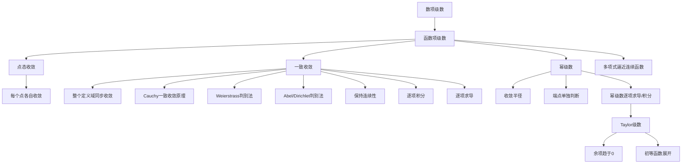

# 第十章：函数项级数

> 依据 PDF 第 69-117 页整理。PDF 是扫描版，无可抽取文字层；本笔记以扫描页中可确认的定义、定理和章节结构为准。个别定理编号或完整条件若标注“需人工确认”，后续做习题时应回到 PDF 原页核对。

## 1. 本章在研究什么

第九章研究的是无穷多个数相加：

$$
\sum_{n=1}^{\infty}x_n.
$$

第十章把每一项从“数”换成“函数”，于是研究对象变成

$$
\sum_{n=1}^{\infty}u_n(x).
$$

这看起来只是把 $x_n$ 改成 $u_n(x)$，但本质难度高了一个层级。因为对每一个固定的 $x$，它确实只是一个数项级数；可是不同的 $x$ 处，收敛速度可能完全不同。于是出现本章的核心问题：

- 对每个 $x$ 都收敛，是否足够好？
- 如果每个 $u_n(x)$ 都连续，和函数 $S(x)$ 是否连续？
- 如果每个 $u_n(x)$ 可积，能否逐项积分？
- 如果每个 $u_n(x)$ 可导，能否逐项求导？
- 幂级数为什么比一般函数项级数更好？
- 一个函数什么时候等于自己的 Taylor 级数？

教材一开始就展示：点态收敛并不足以保证极限与积分、求导交换。直观地说，点态收敛只保证“每个点迟早稳定”，但每个点的“迟早”可以不同；一致收敛则要求整个区间一起稳定。

本章在考试中通常这样出现：

- 求函数项级数的收敛域和和函数；
- 判断点态收敛与一致收敛；
- 用 Weierstrass 判别法、Abel 判别法、Dirichlet 判别法证明一致收敛；
- 判断极限能否与积分、求导交换；
- 求幂级数收敛半径和收敛域；
- 用 Taylor 展开求和、求积分近似或证明恒等式；
- 区分 Taylor 展开和多项式一致逼近。

## 2. 本章知识地图

本章结构：

1. 函数项级数的一致收敛性：从点态收敛过渡到一致收敛。
2. 一致收敛级数的判别与性质：解决“怎么判别”和“一致收敛带来什么好处”。
3. 幂级数：最重要的一类函数项级数。
4. 函数的幂级数展开：Taylor 级数与初等函数展开。
5. 用多项式逼近连续函数：多项式逼近思想。

## 3. 核心概念详解

### [[函数项级数]]

#### 定义

设 $u_n(x)$，$n=1,2,\ldots$，是在公共定义域 $E$ 上定义的一列函数，形式和

$$
u_1(x)+u_2(x)+\cdots+u_n(x)+\cdots
$$

称为函数项级数，记为

$$
\sum_{n=1}^{\infty}u_n(x).
$$

#### 直观理解

它就是“每一项都是函数的无穷和”。固定 $x=x_0$ 后，它退化成数项级数

$$
\sum_{n=1}^{\infty}u_n(x_0).
$$

所以函数项级数既有“级数”的问题，也有“函数”的问题。

#### 为什么要引入这个概念

很多函数无法用有限个初等表达式简单表示，但可以用无限多个简单函数叠加表示。例如幂级数、Fourier 级数、Taylor 展开都属于这种思想。

#### 关键条件

- 各 $u_n$ 要有公共定义域；
- 固定 $x$ 后才能使用数项级数判别法；
- 逐点收敛不自动保证和函数具有良好性质。

#### 典型例子

$$
\sum_{n=0}^{\infty}x^n
$$

是函数项级数。固定 $x$ 后，它就是几何级数；当 $|x|<1$ 时收敛，和函数为

$$
S(x)=\frac{1}{1-x}.
$$

#### 反例或易错例子

不要以为每个 $u_n(x)$ 连续，和函数就一定连续。若只知道点态收敛，这个结论可能失败。

#### 和其他概念的区别

数项级数的和是一个数；函数项级数的和通常是一个函数。

#### 考试中怎么识别

看到 $\sum u_n(x)$、$\sum f_n(x)$、求收敛域、求和函数、逐项积分/求导，就进入函数项级数问题。

### [[点态收敛]]

#### 定义

设函数项级数 $\sum u_n(x)$ 在 $E$ 上定义。若对固定的 $x_0\in E$，数项级数

$$
\sum_{n=1}^{\infty}u_n(x_0)
$$

收敛，则称函数项级数在点 $x_0$ 收敛，$x_0$ 称为收敛点。所有收敛点组成的集合称为收敛域。若收敛域为 $D$，则在 $D$ 上定义和函数

$$
S(x)=\sum_{n=1}^{\infty}u_n(x).
$$

#### 直观理解

点态收敛就是“一个点一个点地看”。每个点都可以有自己的收敛速度。

#### 为什么要引入这个概念

它是函数项级数最基本的收敛方式。没有点态收敛，就谈不上和函数。

#### 关键条件

- 固定 $x$ 后再判断数项级数；
- 点态收敛允许 $N=N(x,\varepsilon)$ 依赖于 $x$；
- 点态收敛一般不保证连续性、可积性、可导性。

#### 典型例子

$$
S_n(x)=x^n,\qquad x\in[0,1].
$$

当 $0\le x<1$ 时，$x^n\to0$；当 $x=1$ 时，$x^n\to1$。所以 $S_n$ 在 $[0,1]$ 上点态收敛到

$$
S(x)=
\begin{cases}
0,&0\le x<1,\\
1,&x=1.
\end{cases}
$$

#### 反例或易错例子

上例中每个 $S_n(x)=x^n$ 都连续，但极限函数不连续。这说明点态收敛不保持连续性。

#### 和其他概念的区别

点态收敛是“每个点分别收敛”；一致收敛是“整个集合一起收敛”。

#### 考试中怎么识别

题目问“收敛域”“和函数”，通常先做点态收敛：固定 $x$，把它当数项级数。

### [[一致收敛]]

#### 定义

设函数序列 $S_n(x)$ 在 $D$ 上点态收敛到 $S(x)$。若对任意 $\varepsilon>0$，存在只依赖于 $\varepsilon$ 的正整数 $N=N(\varepsilon)$，使得当 $n>N$ 时，对一切 $x\in D$ 都有

$$
|S_n(x)-S(x)|<\varepsilon,
$$

则称 $S_n(x)$ 在 $D$ 上一致收敛于 $S(x)$，记作

$$
S_n(x)\rightrightarrows S(x).
$$

函数项级数 $\sum u_n(x)$ 在 $D$ 上一致收敛，是指其部分和函数

$$
S_n(x)=\sum_{k=1}^{n}u_k(x)
$$

在 $D$ 上一致收敛。

#### 直观理解

点态收敛像每个学生自己到达终点；一致收敛要求全班所有人同时都进入误差范围。关键是 $N$ 不能随 $x$ 改变。

#### 为什么要引入这个概念

为了让极限过程保留函数的分析性质。教材用例子说明，仅有点态收敛时，极限与积分、求导可能不能交换；一致收敛就是为了解决这类换序问题。

#### 关键条件

- 必须在指定集合 $D$ 上谈一致收敛；
- $N$ 只与 $\varepsilon$ 有关，不与 $x$ 有关；
- 一致收敛比点态收敛强；
- 一致收敛常用

$$
\sup_{x\in D}|S_n(x)-S(x)|\to0
$$

来判断。

#### 典型例子

在 $[0,a]$ 上，若 $0<a<1$，函数序列 $x^n$ 一致收敛到 $0$。因为

$$
\sup_{x\in[0,a]}|x^n-0|=a^n\to0.
$$

#### 反例或易错例子

在 $[0,1]$ 上，$x^n$ 不一致收敛到其点态极限。因为在靠近 $1$ 的地方，$x^n$ 下降得越来越慢，无法找到一个统一的 $N$ 控制所有 $x$。

#### 和其他概念的区别

点态收敛：$N=N(x,\varepsilon)$。一致收敛：$N=N(\varepsilon)$。

#### 考试中怎么识别

题目中出现“在区间上一致收敛”“能否交换极限与积分/求导”“和函数连续性”，应想到一致收敛。

### [[和函数]]

#### 定义

若函数项级数 $\sum u_n(x)$ 在收敛域 $D$ 上点态收敛，则定义

$$
S(x)=\sum_{n=1}^{\infty}u_n(x),\qquad x\in D,
$$

称 $S(x)$ 为该函数项级数的和函数。

#### 直观理解

和函数就是每个点处无穷和的结果拼成的函数。

#### 为什么要引入这个概念

函数项级数最终不是为了得到一串数，而是为了表示一个函数。

#### 关键条件

- 和函数只在收敛域上定义；
- 求出和函数后，还要问收敛是否一致；
- 和函数的连续性、可导性、可积性需要额外条件。

#### 典型例子

$$
\sum_{n=0}^{\infty}x^n=\frac{1}{1-x},\qquad |x|<1.
$$

这里 $S(x)=\frac{1}{1-x}$ 是和函数，定义在 $(-1,1)$。

#### 反例或易错例子

不能在发散点上写和函数。例如上式不能在 $x=1$ 处写成 $\frac{1}{1-1}$。

#### 和其他概念的区别

部分和函数 $S_n(x)$ 是有限和；和函数 $S(x)$ 是极限函数。

#### 考试中怎么识别

题目要求“求和函数”时，一般先求部分和或识别为已知级数，再确定收敛域。

### [[Weierstrass判别法]]

#### 定义

严格说它是定理，不是定义。若存在正项数列 $M_n$，使得对一切 $x\in D$，

$$
|u_n(x)|\le M_n,
$$

且数项级数

$$
\sum_{n=1}^{\infty}M_n
$$

收敛，则函数项级数

$$
\sum_{n=1}^{\infty}u_n(x)
$$

在 $D$ 上绝对一致收敛。定理编号需人工确认。

#### 直观理解

如果每一项函数的绝对值都被一个与 $x$ 无关的“小数列”压住，而这些小数列总和有限，那么所有函数项加起来也能被统一控制。

#### 为什么要引入这个概念

它是证明一致收敛最常用、最省力的方法。

#### 关键条件

- 上界 $M_n$ 必须与 $x$ 无关；
- $\sum M_n$ 必须收敛；
- 得到的是绝对一致收敛，比一致收敛更强。

#### 典型例子

在任意 $D$ 上，

$$
\sum_{n=1}^{\infty}\frac{\sin nx}{n^2}
$$

一致收敛，因为

$$
\left|\frac{\sin nx}{n^2}\right|\le \frac1{n^2},
$$

而 $\sum 1/n^2$ 收敛。

#### 反例或易错例子

若只能找到 $M_n(x)$ 依赖 $x$，就不能用 Weierstrass 判别法。

#### 和其他概念的区别

Weierstrass 判别法证明的是绝对一致收敛；Dirichlet 判别法常处理不绝对收敛但一致收敛的情况。

#### 考试中怎么识别

看到 $\sin nx$、$\cos nx$、有界函数因子、分母有 $n^p$ 且 $p>1$，先尝试找 $M_n$。

### [[幂级数]]

#### 定义

形如

$$
\sum_{n=0}^{\infty}a_n(x-x_0)^n
$$

的函数项级数称为幂级数。教材先主要讨论 $x_0=0$ 的情形：

$$
\sum_{n=0}^{\infty}a_nx^n.
$$

#### 直观理解

幂级数就是“无限次多项式”。它的部分和是多项式，因此容易计算、求导、积分。

#### 为什么要引入这个概念

幂级数是函数项级数中性质最好、应用最广的一类。Taylor 展开、初等函数近似、微分方程解法都会用到它。

#### 关键条件

- 收敛情况由收敛半径控制；
- 端点必须单独判断；
- 在收敛半径内部，幂级数有很好的逐项求导、逐项积分性质。

#### 典型例子

$$
\sum_{n=0}^{\infty}x^n
$$

是幂级数，收敛半径为 $1$。

#### 反例或易错例子

不能只求出 $R$ 就写出完整收敛域。例如 $R=1$ 时，$x=1$ 和 $x=-1$ 处可能一个收敛一个发散，也可能都收敛或都发散。

#### 和其他概念的区别

一般函数项级数的项可以很复杂；幂级数的项是 $a_n(x-x_0)^n$，结构非常规整。

#### 考试中怎么识别

看到 $\sum a_nx^n$、求收敛半径、求收敛域、求和函数，想到幂级数。

### [[收敛半径]]

#### 定义

对幂级数

$$
\sum_{n=0}^{\infty}a_nx^n,
$$

令

$$
A=\varlimsup_{n\to\infty}\sqrt[n]{|a_n|}.
$$

教材定义收敛半径 $R$ 为

$$
R=
\begin{cases}
+\infty,&A=0,\\
\frac1A,&0<A<+\infty,\\
0,&A=+\infty.
\end{cases}
$$

#### 直观理解

收敛半径告诉你：以展开中心为圆心，在半径 $R$ 内幂级数收敛，在半径外发散。实变量下就是一个区间。

#### 为什么要引入这个概念

它把无穷多个 $x$ 的收敛性判断压缩成一个数 $R$。

#### 关键条件

- 只决定 $|x|<R$ 与 $|x|>R$；
- $x=\pm R$ 必须单独判断；
- 若中心是 $x_0$，则看 $|x-x_0|<R$。

#### 典型例子

$$
\sum_{n=0}^{\infty}\frac{x^n}{n!}
$$

的收敛半径为 $+\infty$，因为 $\sqrt[n]{1/n!}\to0$。

#### 反例或易错例子

幂级数 $\sum x^n$ 的 $R=1$，但 $x=1$ 发散，$x=-1$ 也发散；而 $\sum x^n/n^2$ 在 $x=\pm1$ 都收敛。

#### 和其他概念的区别

收敛半径是幂级数专属的整体参数；一般函数项级数没有这么简单的半径结构。

#### 考试中怎么识别

题目说“求收敛半径”“求收敛区间”“幂级数”，先算 $R$，再判端点。

### [[Taylor级数]]

#### 定义

若函数 $f$ 在 $x_0$ 的某邻域内任意阶可导，则形式级数

$$
\sum_{n=0}^{\infty}\frac{f^{(n)}(x_0)}{n!}(x-x_0)^n
$$

称为 $f$ 在 $x_0$ 处的 Taylor 级数。

#### 直观理解

Taylor 级数用函数在一点的所有导数信息，试图拼出整个邻域内的函数。

#### 为什么要引入这个概念

多项式最容易计算。Taylor 级数告诉我们：某些函数可以用无限多项式表示，从而可以近似计算、求积分、求极限。

#### 关键条件

- 任意阶可导只保证 Taylor 级数可以写出来；
- 函数不一定等于自己的 Taylor 级数；
- 必须证明余项 $r_n(x)\to0$。

#### 典型例子

教材列出

$$
e^x=\sum_{n=0}^{\infty}\frac{x^n}{n!},\qquad x\in(-\infty,+\infty).
$$

因为 Taylor 余项趋于 $0$。

#### 反例或易错例子

有些函数在某点任意阶可导，但 Taylor 级数不一定在邻域内收敛到原函数。教材在 §4 开头强调答案并不总是肯定。

#### 和其他概念的区别

Taylor 级数是由函数导数生成的幂级数；一般幂级数可以先给定系数，不一定来自某个已知函数的 Taylor 展开。

#### 考试中怎么识别

题目要求“在 $x_0=0$ 处展开”“求到 $x^4$ 项”“用幂级数计算积分”，想到 Taylor 级数。

### [[多项式一致逼近]]

#### 定义

若函数 $f(x)$ 在闭区间 $[a,b]$ 上有定义，且存在多项式序列 $P_n(x)$ 在 $[a,b]$ 上一致收敛到 $f(x)$，则称 $f$ 在 $[a,b]$ 上可以用多项式一致逼近。等价地，对任意 $\varepsilon>0$，存在多项式 $P(x)$，使得

$$
|P(x)-f(x)|<\varepsilon,\qquad \forall x\in[a,b].
$$

#### 直观理解

不要求一个多项式完全等于 $f$，只要求能在整个区间上同时逼近得任意好。

#### 为什么要引入这个概念

多项式是最简单的函数之一。如果连续函数都能被多项式逼近，那么复杂连续函数也可以用简单对象研究。

#### 关键条件

- 教材在闭区间 $[a,b]$ 上讨论；
- 要求一致逼近，不是逐点逼近；
- 不等同于 Taylor 展开。

#### 典型例子

$e^x$ 在任意闭区间上可以用 Taylor 多项式一致逼近。

#### 反例或易错例子

多项式逼近不要求多项式来自 Taylor 多项式。某些连续函数没有方便的 Taylor 展开，仍可被多项式一致逼近。

#### 和其他概念的区别

Taylor 展开依赖某一点的导数；多项式一致逼近强调整个闭区间上的统一误差。

#### 考试中怎么识别

看到“连续函数”“闭区间”“多项式”“一致逼近”，想到本节。

## 4. 重要定理详解

### 函数项级数一致收敛的 Cauchy 收敛原理

#### 定理内容

函数项级数 $\sum u_n(x)$ 在 $D$ 上一致收敛的充分必要条件是：对任意 $\varepsilon>0$，存在正整数 $N=N(\varepsilon)$，使得当 $m>n>N$ 时，对一切 $x\in D$，

$$
\left|u_{n+1}(x)+u_{n+2}(x)+\cdots+u_m(x)\right|<\varepsilon.
$$

#### 使用条件

- 讨论的是函数项级数；
- 不需要预先知道和函数；
- $N$ 不能依赖于 $x$。

#### 结论

可以通过统一控制尾段和来证明一致收敛。

#### 直观解释

一致收敛要求所有点处的尾巴同时变小。Cauchy 原理正是把“尾巴小”写成可检验条件。

#### 证明思路

把函数项级数的部分和 $S_n(x)$ 看作函数序列。一致收敛等价于 $S_n(x)$ 在一致度量下是 Cauchy 列。

#### 考试用途

证明一致收敛，尤其是不方便求和函数时。

#### 使用模板

任取 $\varepsilon>0$。证明存在 $N$，使得对任意 $m>n>N$ 和任意 $x\in D$，

$$
\left|\sum_{k=n+1}^{m}u_k(x)\right|<\varepsilon.
$$

于是由 Cauchy 一致收敛原理，$\sum u_n(x)$ 在 $D$ 上一致收敛。

#### 常见错误

只对每个固定 $x$ 找到 $N(x,\varepsilon)$，没有证明 $N$ 与 $x$ 无关。

### Weierstrass 判别法

#### 定理内容

若存在非负常数列 $M_n$，使

$$
|u_n(x)|\le M_n,\qquad \forall x\in D,
$$

且

$$
\sum_{n=1}^{\infty}M_n
$$

收敛，则

$$
\sum_{n=1}^{\infty}u_n(x)
$$

在 $D$ 上绝对一致收敛。定理编号需人工确认。

#### 使用条件

- 上界 $M_n$ 与 $x$ 无关；
- 控制级数 $\sum M_n$ 收敛；
- 适用于函数项级数。

#### 结论

函数项级数一致收敛，而且绝对一致收敛。

#### 直观解释

把每一项函数都装进一个统一的数字盒子里。如果盒子的总大小有限，函数项的总误差也能统一控制。

#### 证明思路

对尾和使用三角不等式：

$$
\left|\sum_{k=n+1}^{m}u_k(x)\right|
\le \sum_{k=n+1}^{m}|u_k(x)|
\le \sum_{k=n+1}^{m}M_k.
$$

再用数项级数 $\sum M_n$ 的 Cauchy 收敛原理。

#### 考试用途

证明绝对一致收敛。

#### 使用模板

取

$$
M_n=\sup_{x\in D}|u_n(x)|.
$$

若能证明 $M_n$ 被某个收敛数项级数控制，则由 Weierstrass 判别法一致收敛。

#### 常见错误

找的上界仍含 $x$，或者 $\sum M_n$ 不收敛。

### Abel/Dirichlet 一致收敛判别法

#### 定理内容

PDF §2 将第九章 Abel、Dirichlet 思想推广到函数项级数。典型形式是对

$$
\sum a_n(x)b_n(x)
$$

进行判别：若某个因子单调、有界或趋零，另一个因子的部分和在区间上一致有界，则可推出一致收敛。完整条件需人工确认。

#### 使用条件

- 通项能分解成两个因子；
- 要注意“一致有界”；
- 通常用于三角函数项级数。

#### 结论

在不绝对一致收敛的情况下，也可证明一致收敛。

#### 直观解释

三角函数项本身不绝对可和，但部分和有界；若系数逐渐变小，振荡抵消就能统一控制尾和。

#### 证明思路

用 Abel 变换，把乘积和改写成“系数差”和“部分和”的组合，再用单调性和一致有界性估计。

#### 考试用途

证明 $\sum a_n\sin nx$、$\sum a_n\cos nx$ 在闭子区间上一致收敛。

#### 使用模板

设 $a_n$ 单调趋于 $0$，并证明

$$
\left|\sum_{k=1}^{n}b_k(x)\right|\le M
$$

对所有 $n$ 和所有 $x\in D$ 成立。由 Dirichlet 型判别法，$\sum a_nb_n(x)$ 在 $D$ 上一致收敛。

#### 常见错误

只证明对每个 $x$ 部分和有界，没有证明界 $M$ 与 $x$ 无关。

### 连续性定理

#### 定理内容

设函数序列 $S_n(x)$ 的每一项在 $[a,b]$ 上连续，且 $S_n(x)$ 在 $[a,b]$ 上一致收敛于 $S(x)$，则 $S(x)$ 在 $[a,b]$ 上连续。

#### 使用条件

- 每个 $S_n$ 连续；
- 在同一区间上一致收敛；
- PDF 中表述为闭区间 $[a,b]$，其他集合版本需人工确认。

#### 结论

一致收敛保持连续性。

#### 直观解释

连续性是局部稳定，一致收敛是整体误差小。用“极限函数与某个连续的 $S_N$ 很接近”来传递连续性。

#### 证明思路

三角不等式拆成三段：

$$
|S(x)-S(x_0)|
\le |S(x)-S_N(x)|+|S_N(x)-S_N(x_0)|+|S_N(x_0)-S(x_0)|.
$$

两端由一致收敛控制，中间由 $S_N$ 连续控制。

#### 考试用途

证明和函数连续；反过来判断某个收敛不是一致收敛。

#### 使用模板

因为每个 $S_n$ 在 $[a,b]$ 上连续，且 $S_n\rightrightarrows S$，由连续性定理，$S$ 在 $[a,b]$ 上连续。

#### 常见错误

只有点态收敛就使用连续性定理。

### 逐项积分定理

#### 定理内容

若 $f_n(x)$ 在 $[a,b]$ 上可积，且 $f_n(x)$ 一致收敛于 $f(x)$，则

$$
\lim_{n\to\infty}\int_a^b f_n(x)\,dx
=\int_a^b f(x)\,dx.
$$

对函数项级数，若 $\sum u_n(x)$ 一致收敛，并且各项可积，则通常可写

$$
\int_a^b\sum_{n=1}^{\infty}u_n(x)\,dx
=\sum_{n=1}^{\infty}\int_a^b u_n(x)\,dx.
$$

定理编号和完整条件需人工确认。

#### 使用条件

- 在有限闭区间上；
- 一致收敛；
- 各项可积。

#### 结论

积分与极限、积分与无穷求和可以交换。

#### 直观解释

一致收敛保证整个区间上的误差都小，因此误差积分也小。

#### 证明思路

估计

$$
\left|\int_a^b f_n-\int_a^b f\right|
\le \int_a^b |f_n-f|
\le (b-a)\sup_{x\in[a,b]}|f_n(x)-f(x)|.
$$

#### 考试用途

用幂级数或函数项级数计算积分。

#### 使用模板

先证明 $\sum u_n(x)$ 在 $[a,b]$ 上一致收敛，且各 $u_n$ 可积，于是可逐项积分。

#### 常见错误

在无界区间或反常积分中直接套有限区间逐项积分定理。

### 逐项求导定理

#### 定理内容

常见形式：若 $f_n$ 在 $[a,b]$ 上可导，存在一点 $x_0$ 使 $\{f_n(x_0)\}$ 收敛，且导函数序列 $f'_n(x)$ 在 $[a,b]$ 上一致收敛于某函数 $g(x)$，则 $f_n$ 一致收敛于某函数 $f$，且

$$
f'(x)=g(x)=\lim_{n\to\infty}f'_n(x).
$$

对级数形式，若 $\sum u_n'(x)$ 一致收敛并有一个点处 $\sum u_n(x_0)$ 收敛，则

$$
\left(\sum_{n=1}^{\infty}u_n(x)\right)'
=\sum_{n=1}^{\infty}u_n'(x).
$$

完整条件需人工确认 PDF 定理原文。

#### 使用条件

- 导函数级数一致收敛；
- 需要至少一个点的原级数收敛；
- 求导换序比积分换序条件更严格。

#### 结论

可以逐项求导。

#### 直观解释

函数值是否收敛还不够，导数的变化也必须统一稳定，否则极限函数可能失去可导性。

#### 证明思路

由

$$
f_n(x)-f_n(x_0)=\int_{x_0}^{x}f_n'(t)\,dt
$$

和导函数一致收敛，借助逐项积分定理得到极限函数的导数。

#### 考试用途

证明和函数可导，或用逐项求导求幂级数和函数。

#### 使用模板

验证 $\sum u_n'(x)$ 一致收敛，并验证某一点 $x_0$ 处 $\sum u_n(x_0)$ 收敛。于是原级数可逐项求导。

#### 常见错误

只证明 $\sum u_n(x)$ 一致收敛，就直接逐项求导。这是不够的。

### Cauchy-Hadamard 定理

#### 定理内容

对幂级数

$$
\sum_{n=0}^{\infty}a_nx^n,
$$

令

$$
A=\varlimsup_{n\to\infty}\sqrt[n]{|a_n|},\qquad
R=
\begin{cases}
+\infty,&A=0,\\
\frac1A,&0<A<+\infty,\\
0,&A=+\infty.
\end{cases}
$$

则当 $|x|<R$ 时幂级数绝对收敛；当 $|x|>R$ 时发散。端点 $x=\pm R$ 需另行判断。

#### 使用条件

- 幂级数；
- 端点不能由定理直接决定。

#### 结论

得到收敛半径。

#### 直观解释

幂级数每项像 $a_nx^n$，根值判别给出 $|x|\sqrt[n]{|a_n|}$ 的大小，因而自然出现半径 $R$。

#### 证明思路

对数项级数 $\sum |a_nx^n|$ 使用 Cauchy 根值判别。

#### 考试用途

求幂级数收敛半径、收敛域。

#### 使用模板

先算

$$
A=\varlimsup\sqrt[n]{|a_n|},\quad R=1/A.
$$

再分别检验 $x=R$ 和 $x=-R$。

#### 常见错误

忘记端点单独代入原级数。

### Abel 第二定理

#### 定理内容

PDF 中定理 10.3.3 表明：若幂级数 $\sum a_nx^n$ 的收敛半径为 $R$，则：

1. 在 $(-R,R)$ 内任意闭区间 $[a,b]\subset(-R,R)$ 上一致收敛；
2. 若在端点 $x=R$ 收敛，则在任意闭区间 $[a,R]\subset(-R,R]$ 上一致收敛。

端点 $x=-R$ 的对应表述需人工确认。

#### 使用条件

- 幂级数；
- 讨论闭区间包含在收敛区间内部，或包含已收敛端点；
- 若端点发散，不能使用端点结论。

#### 结论

幂级数在收敛区间内部具有局部一致收敛性。

#### 直观解释

只要不贴到发散边界，幂级数的收敛速度可以被统一控制。

#### 证明思路

内部闭区间用 Weierstrass 判别法；端点情形用 Abel 判别思想。

#### 考试用途

证明幂级数可逐项积分、逐项求导；处理端点附近的一致收敛。

#### 使用模板

由于 $[a,b]\subset(-R,R)$，取 $\rho<R$ 使 $|x|\le\rho$。由收敛半径定义，$\sum |a_n|\rho^n$ 收敛，因此由 Weierstrass 判别法，幂级数在 $[a,b]$ 上一致收敛。

#### 常见错误

说“幂级数在 $(-R,R)$ 上一致收敛”。一般只能说在内部任意闭区间上一致收敛。

### Taylor 公式与余项

#### 定理内容

若 $f$ 在 $x_0$ 附近有足够阶导数，则

$$
f(x)=\sum_{k=0}^{n}\frac{f^{(k)}(x_0)}{k!}(x-x_0)^k+r_n(x).
$$

PDF 中出现 Lagrange 余项和 Cauchy 余项形式。Lagrange 余项常写为

$$
r_n(x)=\frac{f^{(n+1)}(\xi)}{(n+1)!}(x-x_0)^{n+1},
$$

其中 $\xi$ 在 $x_0$ 与 $x$ 之间。Cauchy 余项公式需人工确认。

#### 使用条件

- 函数有相应阶数导数；
- 要判断展开是否成立，必须证明 $r_n(x)\to0$。

#### 结论

若 $r_n(x)\to0$，则函数等于其 Taylor 级数。

#### 直观解释

Taylor 多项式是局部最佳多项式近似，余项说明“剩下多少”。余项趋零，才说明无限展开真的还原函数。

#### 证明思路

由 Taylor 公式带余项，估计余项极限。

#### 考试用途

初等函数展开、近似计算、证明级数恒等式。

#### 使用模板

写出 Taylor 公式：

$$
f(x)=T_n(x)+r_n(x).
$$

证明在所需范围内 $r_n(x)\to0$，于是

$$
f(x)=\sum_{n=0}^{\infty}\frac{f^{(n)}(x_0)}{n!}(x-x_0)^n.
$$

#### 常见错误

只写出 Taylor 级数，不说明余项是否趋于 $0$。

### 多项式一致逼近定理

#### 定理内容

PDF §5 讨论用多项式逼近连续函数。其核心结论是：闭区间上的连续函数可以被多项式一致逼近。具体定理名称与完整表述需人工确认。

#### 使用条件

- 函数在闭区间 $[a,b]$ 上连续；
- 逼近是统一误差意义下的逼近。

#### 结论

对任意 $\varepsilon>0$，存在多项式 $P(x)$，使得

$$
|P(x)-f(x)|<\varepsilon,\qquad \forall x\in[a,b].
$$

#### 直观解释

多项式虽然简单，但足够丰富，可以在整个闭区间上把连续函数描得任意精细。

#### 证明思路

教材具体证明方式需人工确认。常见思想是构造一列多项式逼近 $f$。

#### 考试用途

概念判断、证明题、理解一致逼近。

#### 使用模板

因为 $f$ 在 $[a,b]$ 上连续，由多项式一致逼近定理，对任意 $\varepsilon>0$，存在多项式 $P$ 使 $\sup_{x\in[a,b]}|P(x)-f(x)|<\varepsilon$。

#### 常见错误

把“多项式一致逼近”误认为“Taylor 级数展开”。两者不是一回事。

## 5. 典型方法总结

### 判断型题

1. 求收敛域：固定 $x$，把 $\sum u_n(x)$ 当数项级数。
2. 判一致收敛：优先看 $\sup |S_n-S|$ 或用 Cauchy 原理。
3. 若通项容易统一估计：用 Weierstrass 判别法。
4. 若有三角项或振荡项：考虑 Abel/Dirichlet 判别。
5. 幂级数：先求 $R$，再判端点。

### 证明型题

- 证明一致收敛：找统一的 $N$ 或统一的控制级数；
- 证明不一致收敛：找点列 $x_n$，使误差不趋于 $0$；
- 证明和函数连续：先证明一致收敛，再用连续性定理；
- 证明可逐项积分/求导：逐条核对定理条件。

### 计算型题

- 利用几何级数求和函数；
- 对已知幂级数逐项积分或逐项求导；
- 用 Taylor 展开近似计算积分；
- 用常见展开式变形求级数和。

### 构造反例题

- 点态收敛但不一致收敛：$x^n$ 在 $[0,1]$ 上；
- 连续函数列点态极限不连续：仍可用 $x^n$；
- 极限与积分不可交换：教材 §1 给出相关例子，具体题面需人工确认；
- Taylor 级数不一定等于原函数：需注意余项不趋零的情况。

## 6. 易混概念对比表

| 概念 A | 概念 B | 区别 | 常见误区 | 判断方法 |
|---|---|---|---|---|
| 点态收敛 | 一致收敛 | 点态的 $N$ 可依赖 $x$；一致的 $N$ 不依赖 $x$ | 求出点态极限就以为一致 | 看 $\sup_{x\in D}|S_n-S|$ 是否趋 0 |
| 函数项级数 | 数项级数 | 前者每项是函数，固定 $x$ 后才变成后者 | 直接套数项判别法不管 $x$ | 先固定 $x$ 求收敛域 |
| 和函数 | 部分和函数 | 和函数是极限，部分和函数是有限和 | 把 $S_n$ 当 $S$ | 写清 $S_n=\sum_{k=1}^n u_k$ |
| 一致收敛 | 绝对一致收敛 | 绝对一致收敛更强 | Weierstrass 判别失败就说不一致 | 判别法失败不代表结论失败 |
| 逐项积分 | 逐项求导 | 求导换序条件更强 | 一致收敛后直接逐项求导 | 检查导函数级数一致收敛 |
| 收敛半径 | 收敛域 | 半径不决定端点 | 求出 $R$ 就结束 | 端点代入原级数 |
| 幂级数 | Taylor 级数 | Taylor 系数来自导数；幂级数系数可任意给定 | 所有幂级数都叫 Taylor 级数 | 看系数是否为 $f^{(n)}(x_0)/n!$ |
| Taylor 级数 | Taylor 展开成立 | 能写 Taylor 级数不代表等于函数 | 忽略余项 | 证明 $r_n(x)\to0$ |
| Taylor 展开 | 多项式一致逼近 | Taylor 依赖一点导数；逼近只要求全区间误差小 | 以为逼近必须来自 Taylor | 看题目是否强调闭区间一致误差 |

## 7. 本章自测问题

1. 函数项级数和数项级数的本质区别是什么？
2. 点态收敛中，为什么 $N$ 可以依赖 $x$？
3. 一致收敛定义里最关键的一句话是什么？
4. 举例说明点态收敛不能保持连续性。
5. Weierstrass 判别法为什么要求 $M_n$ 与 $x$ 无关？
6. 逐项积分和逐项求导的条件有什么差别？
7. 求幂级数收敛域时，为什么端点必须单独判断？
8. Cauchy-Hadamard 定理和第九章 Cauchy 根值判别有什么关系？
9. 为什么函数有 Taylor 级数不代表它等于 Taylor 级数？
10. 多项式一致逼近和 Taylor 展开有什么区别？

## 8. 本章小结

本章最重要的思想是：从“每个点都收敛”到“整个区间统一收敛”。

点态收敛只说明函数项级数在每个点上像数项级数一样有和；一致收敛则说明这种收敛在整个定义域上速度可统一控制。正是这个统一控制，使连续性、积分、求导等分析性质有机会从部分和函数传递到和函数。

幂级数是本章最友好的一类函数项级数：它有收敛半径，在半径内部局部一致收敛，并且可以逐项求导、逐项积分。Taylor 级数进一步告诉我们，许多函数可以由幂级数表示，但必须通过余项趋零来确认。

期末复习时，要抓住三条主线：

1. 一致收敛的定义和判别；
2. 一致收敛带来的换序定理；
3. 幂级数和 Taylor 展开的计算能力。

如果一道题看起来复杂，先问自己：这是在求收敛域，还是在证明一致收敛，还是在使用一致收敛换序？入口找对，题目就会安静很多。
