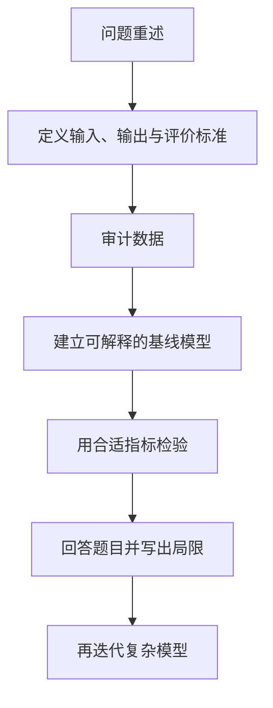

# C 题完整建模工作流

## 1. 第一原则：先形成最小闭环

比赛中最危险的不是模型简单，而是只有复杂算法、没有可验证结论。拿到题目后优先完成：

## 2. 阶段一：审题与拆问

对每一个小问记录：

| 项目 | 要回答的内容 |
|---|---|
| 决策对象 | 对谁或什么做预测、分类、评价、优化？ |
| 输出 | 数值、类别、排序、方案还是路径？ |
| 约束 | 资源、时间、容量、逻辑、非负、整数？ |
| 数据 | 哪张表、哪几列、主键和时间粒度是什么？ |
| 评价标准 | 误差最小、收益最大、稳定、可解释还是公平？ |
| 与前问关系 | 前问结果是不是后问输入？误差如何传递？ |

详见[[C题审题与问题拆解]]。

## 3. 阶段二：数据审计

先生成数据质量报告，再决定清洗方式：

- 行列数、字段含义、单位和时间范围；
- 主键是否唯一；
- 数据类型是否正确；
- 缺失率、重复率、异常范围；
- 逻辑约束是否满足；
- 多表连接后行数是否异常膨胀；
- 目标变量是否失衡；
- 是否存在未来信息或答案泄漏。

入口：[[pandas数据读取与质量审计]]、[[多表合并与主键验证]]、[[缺失机制MCAR-MAR-MNAR]]。

## 4. 阶段三：探索性分析

EDA 的任务不是“多画图”，而是为后续决策提供证据：

- 分布决定是否变换、是否用稳健统计；
- 缺失模式决定插补策略；
- 散点关系决定线性或非线性模型；
- 时间图决定趋势、季节性和异常点；
- 相关性与 VIF 决定是否处理共线性；
- 类别比例决定评价指标和采样策略。

入口：[[EDA完整工作流]]。

## 5. 阶段四：建立基线

基线必须简单、透明、快速：

| 问题 | 推荐基线 |
|---|---|
| 连续值预测 | 均值/上一期、[[线性回归]] |
| 二分类 | 多数类、[[Logistic回归]] |
| 时间序列 | 上一期、季节朴素法、[[指数平滑ETS]] |
| 聚类 | [[K-Means聚类]] |
| 排序评价 | 等权 TOPSIS |
| 资源优化 | [[线性规划]] |

复杂模型只有在交叉验证、解释或稳健性上确实改进时才值得保留。

## 6. 阶段五：模型训练或求解

- 预测模型：划分训练/验证/测试，预处理放进 Pipeline。
- 时间序列：按时间顺序滚动验证，不能随机打乱。
- 优化模型：明确决策变量、目标函数、约束与可行域。
- 综合评价：先处理指标方向和量纲，再赋权和排序。
- 统计推断：先写原假设、备择假设、显著性水平和前提。

## 7. 阶段六：检验与论证

一条完整的论证链通常包含：

1. 基础性能：[[回归评价指标]]、[[分类评价指标]]或[[聚类评价指标]]。
2. 诊断：[[残差诊断与统计假设]]。
3. 稳定性：[[数据集划分与交叉验证|交叉验证]]、[[稳健性检验]]。
4. 参数影响：[[敏感性分析]]。
5. 不确定性：[[Bootstrap重抽样与置信区间]]或[[不确定性分析]]。
6. 替代方法：[[模型对比与消融实验]]。

## 8. 阶段七：从结果到结论

不要只写“准确率为 0.91”。应回答：

- 相比什么基线提高了多少？
- 错误集中在哪些样本？
- 哪些变量最重要，方向是否符合业务？
- 结论在参数扰动或样本变化后是否保持？
- 建议可执行吗，代价和风险是什么？

## 9. 阶段八：论文与复现

论文正文控制核心证据，完整代码和中间材料进入附录/支撑材料。每张图表必须能从代码重现。入口：

- [[数学建模论文结构与表达]]
- [[图表规范与结果叙事]]
- [[代码项目结构与复现清单]]
- [[2026竞赛规则与赛前检查清单]]

## 10. 竞赛中的停止规则

满足以下条件时先停止加模型：

- 已有一个能回答问题的基线；
- 数据处理理由清楚；
- 评价指标与题目目标一致；
- 主要结论通过至少一种稳定性检查；
- 代码可以从原始数据一键得到关键表图；
- 论文能够说清“为什么”和“有什么用”。

之后再根据剩余时间改进，而不是无限调参。
