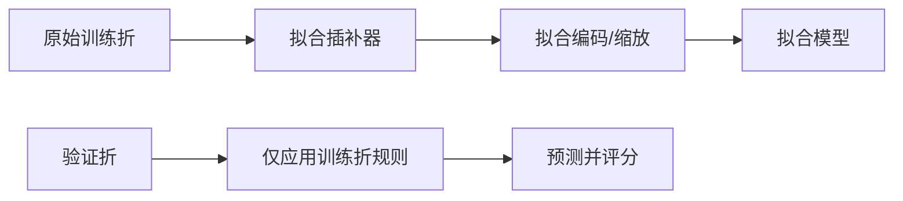

# 防止数据泄漏与 Pipeline

## 1. 什么是数据泄漏

模型训练时获得了实际部署或预测时不可能知道的信息，导致验证分数虚高。

常见来源：

- 全数据计算均值、标准差、插补值；
- 先用全数据筛特征，再交叉验证；
- 特征含结果发生后的信息；
- 时间序列使用未来值；
- 同一个人/设备的记录跨训练和测试；
- 对测试集反复查看并调参。

## 2. 正确结构



## 3. 完整可运行案例

```python
import pandas as pd
from sklearn.model_selection import train_test_split, cross_validate
from sklearn.compose import ColumnTransformer
from sklearn.pipeline import Pipeline
from sklearn.impute import SimpleImputer
from sklearn.preprocessing import OneHotEncoder, StandardScaler
from sklearn.linear_model import LogisticRegression

df = pd.DataFrame({
    "年龄": [20, 22, 35, 40, 28, 50, 45, 31],
    "收入": [3.0, None, 8.0, 10.0, 5.0, 12.0, 9.0, 6.0],
    "地区": ["东", "西", "东", "北", "西", "东", "北", "西"],
    "是否购买": [0, 0, 1, 1, 0, 1, 1, 0]
})

X = df.drop(columns="是否购买")
y = df["是否购买"]

num_cols = ["年龄", "收入"]
cat_cols = ["地区"]

preprocess = ColumnTransformer([
    ("num", Pipeline([
        ("imputer", SimpleImputer(strategy="median")),
        ("scaler", StandardScaler())
    ]), num_cols),
    ("cat", Pipeline([
        ("imputer", SimpleImputer(strategy="most_frequent")),
        ("onehot", OneHotEncoder(handle_unknown="ignore"))
    ]), cat_cols)
])

model = Pipeline([
    ("preprocess", preprocess),
    ("classifier", LogisticRegression(max_iter=1000))
])

X_train, X_test, y_train, y_test = train_test_split(
    X, y, test_size=0.25, stratify=y, random_state=42
)

model.fit(X_train, y_train)
print("测试准确率:", model.score(X_test, y_test))
```

## 4. 与交叉验证配合

```python
scores = cross_validate(
    model,
    X,
    y,
    cv=4,
    scoring=["accuracy", "f1"],
    return_train_score=True
)
print(scores)
```

每一折都会只在该折训练部分拟合预处理器。

## 5. 时间序列特殊泄漏

- 随机划分；
- 用未来窗口计算特征；
- 用全时期均值填补过去；
- 预测时使用修订后的最终数据；
- 先季节分解全序列，再评估过去预测。

必须采用按时间推进的验证，并确保每个特征在预测时刻可获得。

## 6. 论文表达

> 为避免预处理信息泄漏，缺失值插补、标准化和类别编码均封装在 Pipeline 中，并在每个交叉验证训练折内独立拟合。测试集在模型及超参数确定前保持封存。

## 7. 自查清单

- [ ] 每个 `fit` 是否只看训练数据？
- [ ] 特征在真实预测时刻是否可获得？
- [ ] 同一实体是否跨集合？
- [ ] 测试集是否只评估一次？
- [ ] 特征选择是否位于 Pipeline 内？
- [ ] 时间特征是否使用了未来？

## 8. 练习

先在全数据上标准化再交叉验证；再用 Pipeline 交叉验证。换成含明显分布差异的小数据，比较两个分数并解释为什么前者偏乐观。

参考：[scikit-learn Common pitfalls](https://scikit-learn.org/stable/common_pitfalls.html)。
