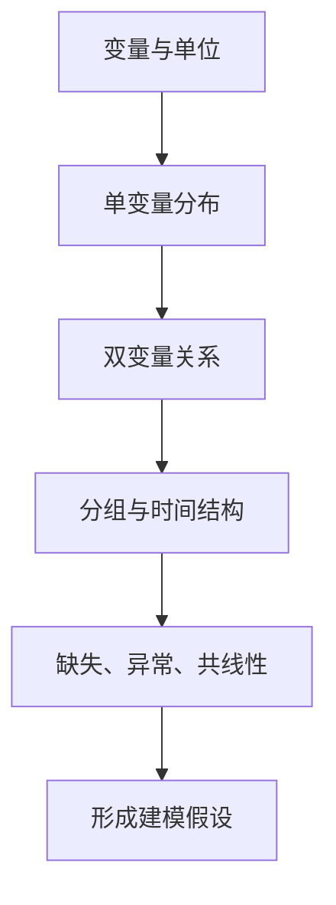

# EDA 完整工作流

## 1. EDA 的目标

探索性数据分析不是给论文“配图”，而是发现模型结构、数据问题和可解释假设。每张图都应推动一个后续决策。



## 2. 推荐顺序

1. 数据字典：变量类型、单位、业务含义。
2. 质量概览：缺失、重复、范围。
3. 单变量：中心、离散、偏度、类别频数。
4. 双变量：散点、箱线、列联表、相关。
5. 多变量：分面图、相关热图、PCA。
6. 时间/空间：趋势、季节、突变、区域差异。
7. 输出“发现—证据—决策”表。

## 3. 最小代码框架

```python
import pandas as pd
import seaborn as sns
import matplotlib.pyplot as plt

print(df.shape)
print(df.dtypes)
print(df.isna().mean().sort_values(ascending=False))
print(df.describe(include="all").T)

num = df.select_dtypes(include="number")

fig, axes = plt.subplots(1, 2, figsize=(10, 4))
sns.histplot(df, x="目标", kde=True, ax=axes[0])
sns.boxplot(df, x="组别", y="目标", ax=axes[1])
fig.tight_layout()
plt.show()

corr = num.corr(method="spearman")
sns.heatmap(corr, cmap="coolwarm", center=0)
plt.tight_layout()
plt.show()
```

## 4. 发现—证据—决策表

| 发现 | 证据 | 对建模的影响 |
|---|---|---|
| 目标变量右偏 | 直方图、偏度 | 比较对数变换或稳健误差 |
| 地区差异明显 | 分组箱线图 | 加入地区特征或分层模型 |
| 变量高度相关 | 热图、VIF | PCA、正则化或删冗余 |
| 明显季节性 | 时间图、季节子图 | SARIMA/ETS |
| 类别极不平衡 | 频数表 | 分层划分，关注 F1/PR-AUC |

## 5. EDA 与确认性分析分开

EDA 中发现关系后，再在验证数据或明确假设检验中确认。若不断看同一数据提出并验证假设，p 值会偏乐观。

## 6. 论文怎么呈现

正文只保留会影响模型选择或结论的图表，其余放附录。建议句式：

> 目标变量分布呈明显右偏且存在少量高值；因此主模型采用 MAE 作为主要误差指标，并将对数变换模型作为稳健性对照。散点图显示变量 A 与目标近似单调但非线性，故除线性基线外进一步比较树模型。

## 7. 易错点

- 一次绘制几十张图但没有结论。
- 相关热图直接当作因果证据。
- 在全数据上反复试图后，把最显著关系当作预先假设。
- 图中单位、样本量、颜色含义和缺失处理不说明。

关联：[[描述统计与分布诊断]]、[[建模可视化选择指南]]。

