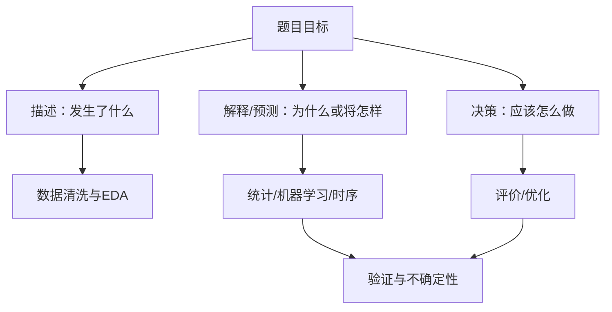

# C 题审题与问题拆解

## 1. 先翻译成输出类型

把每一问改写成一句“给定……，求……”：

| 题目动词 | 可能任务 |
|---|---|
| 分析影响因素 | 回归、检验、解释 |
| 预测未来 | 时间序列、监督回归 |
| 评价/排序 | 赋权 + TOPSIS/模糊评价 |
| 分类/识别 | 分类模型、聚类 |
| 制定方案/最优安排 | 规划、启发式优化 |
| 验证结论 | 指标、残差、敏感性、稳健性 |

## 2. 小问拆解表

| 项目 | 第 1 问 | 第 2 问 | 第 3 问 |
|---|---|---|---|
| 输出 |  |  |  |
| 输入字段 |  |  |  |
| 变量粒度 |  |  |  |
| 约束 |  |  |  |
| 可用基线 |  |  |  |
| 主指标 |  |  |  |
| 前问依赖 |  |  |  |
| 风险/不确定性 |  |  |  |

## 3. 三层问题树

## 4. 选题评分

对 A/B/C 题各自 1～5 分：

- 是否理解业务；
- 数据是否可读；
- 能否在 6 小时内形成第一问闭环；
- 队伍是否有方法储备；
- 论文是否容易形成连续主线；
- 外部资料是否合规可得；
- 最大风险是什么。

不要只因为“C 题数据多，看起来能跑模型”就选。

## 5. 第一版模型必须简单

审题后 2 小时内为每问写：

- 一句话目标；
- 一个最小模型；
- 一个评价指标；
- 一个可能替代模型；
- 一个关键假设。

这能防止全队在复杂算法上发散。

## 6. 常见陷阱

- 一问要求解释，却只做预测。
- 一问要求方案，却只给评分。
- 后一问依赖前问，误差却被当成无误差输入。
- 题目说“合理”，论文没有检验标准。
- 为每一问选不同高级模型，全文没有主线。

## 7. 练习

任取一套往年 C 题，不运行代码，用 30 分钟完成拆解表，并在[[C题方法选择速查表]]中为每问选基线和进阶方案。

